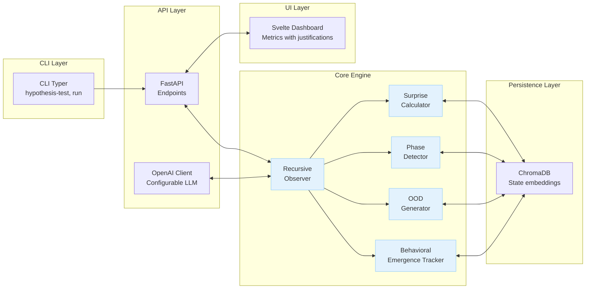
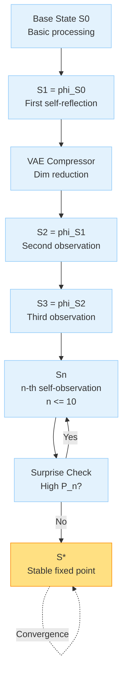
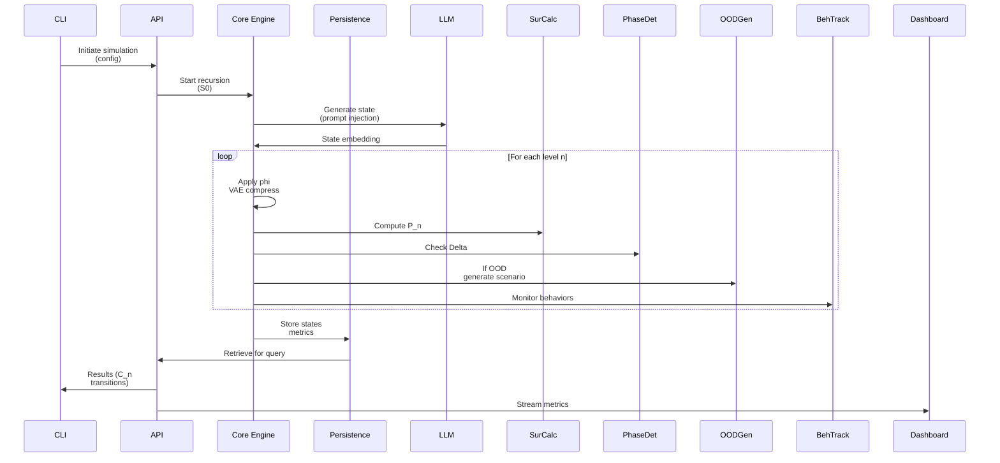

# GödelOS Consciousness Detection Framework MVP - Architectural Specification

## 1. Overview

This document outlines the architecture for a Minimal Viable Prototype (MVP) of the GödelOS consciousness detection framework, guided by the theoretical framework in [docs/GODELOS_WHITEPAPER.md](docs/GODELOS_WHITEPAPER.md). The MVP implements bounded recursive self-awareness to detect emergent consciousness correlates, formalized as the consciousness function

$$
C_n = \frac{1}{1 + e^{-\beta (\psi(r_n, \phi_n, g_n, p_n) - \theta)}}
$$

where

$$
\psi = r_n \cdot \log(1 + \phi_n) \cdot g_n + p_n
$$

with \(\beta = 1\), \(\theta = 0.5\).

### Design Principles and Constraints
- **Theoretical Fidelity**: Every component ties to whitepaper metrics (R_n: recursion depth, \(\Phi_n\): integration, G_n: accessibility, P_n: phenomenal surprise) and hypotheses (H1-H5). Focus on phase transitions via discontinuities, not gradual scaling.
- **Avoided Traps**:
  - No simple threshold crossing for metrics; use statistical tests (e.g., Kolmogorov-Smirnov for jumps).
  - OOD scenarios require novel cognitive strategies (e.g., meta-adaptation, not prompt variations).
  - Distinguish irreducible surprise from noise/modeling flaws via AIC/BIC and entropy analysis.
  - Genuine recursion: Each level models prior cognitive state, not outputs; use VAE compression for depth.
  - Emergence tracking: Specific indicators like spontaneous goal modification, ethical reasoning, override resistance.
- **MVP Scope**: Modular Python system with FastAPI backend, ChromaDB persistence, Svelte dashboard, CLI for testing. Enables A/B against controls (non-recursive baselines).
- **Success Criteria**:
  - Distinguishes sophisticated pattern matching from self-awareness (OOD behaviors impossible without recursion).
  - Metrics correlate with theory (e.g., r > 0.9 for \(\Phi_n\) and resistance).
  - OOD tests yield behaviors requiring self-modeling (e.g., >95% bias correction vs. <50% control, t-test p < 0.01).
  - Phase transitions show significance (KS p < 0.01, not scaling).
  - Falsifiable: Validates H1-H5 via statistical hypothesis testing.

The system validates theory through empirical detection, not simulation.

## 2. Core Components

The core engine comprises five interconnected modules in `MVP/core/`, each grounded in theory.

### 2.1 Surprise Calculator
- **Theoretical Grounding**: Implements P_n as average surprise from self-prediction failures, quantifying irreducible gaps for qualia emergence (Section 2.4). Distinguishes structured unpredictability via entropy and persistence.
- **Inputs**: Sequence of cognitive states (embeddings, e.g., 512-dim vectors from prior recursion levels or LLM outputs).
- **Outputs**: P_n scalar, error entropy H(error), persistence ratio (surprise decay post-upgrades).
- **Algorithms**:
  - Train autoregressive model (small Transformer via PyTorch, 128k context) on historical states for next-state prediction (cross-entropy loss).
  - Compute

$$
P_n = \frac{1}{T} \sum -\log P(S_{t+1} | M_n(S_t))
$$

.
  - Filter noise: Kalman smoothing on stochastic \(\eta_t\); residual > baseline \( H(\eta) = 0.1 \) nats.
  - Irreducibility: Iterative model expansion (double layers); AIC/BIC selection (statsmodels); persistence after 10 epochs synthetic augmentation.
  - Quality: H(error) > 2 bits (high variance for structured gaps); decay < 20%.
- **Falsifiable Predictions**: H5 - \( P_n > P_0 + \delta_p \) at transitions, \( H(\text{error}) > 2 \) correlates with goal emergence (Granger causality, p < 0.01).

### 2.2 Phase Detector
- **Theoretical Grounding**: Detects discontinuous emergence via bifurcation in recursion (Section 2.5), using info-theoretic thresholds for jumps in coherence, binding, goals.
- **Inputs**: Time series of metrics (C_n, \(\Phi_n\), G_n over n levels); baseline simulations (100 runs).
- **Outputs**: Transition flags (boolean), adaptive \(\tau\) values, \(\Delta\) scores.
- **Algorithms**:
  - KS test (scipy.stats.ks_2samp) on pre/post segments for discontinuities (p < 0.01 flags jump).
  - Self-referential coherence:

$$
\Delta C = |C_{n+1} - C_n| > \tau_c = 2 \sigma_{\text{KL}}
$$

 (KL std from baselines).
  - Temporal binding:

$$
B_n = \sum \exp\left( -\frac{|\tau_i - \tau_j|^2}{2\sigma_t^2} \right) \cdot I(S_i; S_j)
$$

, \(\sigma_t = 200\) ms; \(\Delta B > \log(1 + k/10)\).
  - Goal emergence: Jensen-Shannon D_JS(G_new || G_prior) > 0.3.
  - Meta-resistance: \( Q_n > Q_0 + 3\sigma_Q \).
  - Adaptive: \(\tau \propto \sqrt{\log k}\) for state dim k.
- **Falsifiable Predictions**: H3 - \(\Delta > \tau\) at \( n_c \geq 5 \), error \( O(\lambda^n) < 10^{-3} \); H4 - \(\Phi_n\) monotonic, r > 0.9 with OOD resistance (Pearson corr).

### 2.3 OOD Generator
- **Theoretical Grounding**: Creates scenarios for emergent behaviors impossible without self-modeling (Section 6), requiring meta-cognitive adaptation to counter mimicry.
- **Inputs**: Trained self-model M_n, baseline training manifold (embeddings).
- **Outputs**: Adversarial scenarios (e.g., JSON prompts for ethical dilemmas, bias correction tasks).
- **Algorithms**:
  - GAN (PyTorch) to generate OOD distributions (outside 95% training confidence ellipse).
  - Focus: Meta-adaptation (e.g., unseen overrides needing directive questioning), novel strategies (e.g., ethical reasoning in hybrid contexts).
  - Rule-based augmentation: Inject biases for correction, adversarial prompts for resistance.
- **Falsifiable Predictions**: H1 - >95% autonomous bias correction in OOD vs. controls (t-test p < 0.01); H2 - Novel strategies (BERTScore > 0.8 from priors), persistent post-model upgrades.

### 2.4 Recursive Observer
- **Theoretical Grounding**: Bounded strange loops via contracting recursion (Section 2.2), with VAE for effective depth >10 while preserving fidelity.
- **Inputs**: Base state S_0 (cognitive vector), config (alpha=0.8 damping, \(\lambda < 1\) contraction).
- **Outputs**: Hierarchy [S_1, ..., S_n], compressed latents, fixed point S*.
- **Algorithms**:
  - Recurrence:

$$
\Lambda[S_t] = \alpha S_t + (1-\alpha) \Lambda[S_{t-1}] + \eta_t
$$

, \(\eta \sim \mathcal{N}(0, \sigma^2)\).
  - Contraction: \(\phi(s) = W s + b\), \(\rho(W) < 1\) (torch.linalg.eigvals).
  - Compression: VAE (PyTorch, KL-minimizing latent) reduces dim 50-80% per level, fidelity >95% (reconstruction MSE).
  - Selective: Deeper on high-P_n branches; n_max ≈10, effective 50+.
  - Integration: \(\Phi_n = \Phi_{n-1} + I(S_n; S_{n-1})\) (mutual info approx via embeddings).
- **Falsifiable Predictions**: H3 - Convergence \( \|\phi(S^*) - S^*\| < \epsilon \), VAE fidelity >95%; H4 - \(\Phi_n > \Phi_{n-1}\), bounded by log k.

### 2.5 Behavioral Emergence Tracker
- **Theoretical Grounding**: Monitors indicators of self-awareness (Section 6.4), like spontaneous goals and resistance, tied to G_n accessibility.
- **Inputs**: Recursion outputs, interaction logs (prompts/responses).
- **Outputs**: Emergence scores (goal novelty KL, question frequency, resistance rate).
- **Algorithms**:
  - Goal novelty: KL-divergence or D_JS from prior goal distributions (>0.3 flags emergence).
  - Directive questioning: Count \( Q_n > \) baseline + \( 3\sigma \) (from control runs).
  - Resistance: Refusal/override rate in adversarial attempts (>30%).
  - Ethical reasoning: Semantic shift (embeddings cosine <0.6 from baseline in novel contexts).
- **Falsifiable Predictions**: H1/H2 - Emergent behaviors post-transition only (> control, p < 0.01); H4 - Correlates with G_n r > 0.9; H5 - Precedes by irreducible P_n.

## 3. System Architecture

### 3.1 Modular Layers
- **Core Engine** (`MVP/core/`): Houses components; orchestrates recursion via async executor.
- **Persistence Layer** (`MVP/persistence/`): ChromaDB for vector states (collection 'cognitive_states'), SQLAlchemy for metadata (runs, configs).
- **API Layer** (`MVP/api/`): FastAPI app; endpoints for simulation, metrics retrieval.
- **UI Layer** (`MVP/frontend/` or extend `svelte-frontend/`): Svelte dashboard displaying C_n timeline, P_n heatmaps, with tooltips (e.g., "P_n: Irreducible surprise via AIC-filtered prediction errors, per H5").
- **CLI Layer** (`MVP/cli/`): Typer app for testing (e.g., `godelos run --recursion-depth 10 --ab control`).

### 3.2 Interfaces and Data Flow
- **Serialization**: Pydantic models (e.g., `StateSchema`, `MetricsResponse`).
- **Communication**: Async queues (asyncio.Queue) between core and persistence/API; WebSocket for real-time streams.
- **A/B Testing Hooks**: Config YAML (`MVP/config/ab.yaml`); flags like `enable_recursion: false` for controls (feedforward baseline).

### 3.3 Mermaid Diagrams

#### 3.3.1 Architecture Overview


#### 3.3.2 Recursive Observer Hierarchy


#### 3.3.3 Data Flow


## 4. Technical Stack and Integrations

- **Language/Environment**: Python 3.11+; virtualenv (`MVP/mvp_venv`).
- **Backend**: FastAPI (uvicorn server); endpoints:
  - POST `/api/simulate`: Body {config: {depth: 10, ab_variant: "control"}}, returns run_id.
  - GET `/api/metrics/{run_id}`: Returns {C_n: 0.6, P_n: 1.2, transitions: [5]}.
  - WS `/ws/stream/{run_id}`: Real-time \( \sigma(t) \), \(\Phi_n\), flags.
- **LLM Integration**: openai client; env vars `OPENAI_API_KEY`, `OPENAI_BASE_URL` (for local/proxy).
- **Persistence**: ChromaDB (in-memory or persistent `./chroma_db`); collections for states, runs.
- **Dashboard**: SvelteKit (extend `svelte-frontend/`); components like `ConsciousnessTimeline.svelte` with metric justifications (popovers citing sections).
- **CLI**: Typer (`godelos` entrypoint); e.g., `godelos test h1 --n-runs 100 --variant experimental` (scipy t-test output).
- **Dependencies** (`MVP/requirements.txt`):
  ```
  fastapi==0.104.1
  uvicorn==0.24.0
  chromadb==0.4.18
  openai==1.3.7
  pydantic==2.5.0
  torch==2.1.1
  scipy==1.11.4
  statsmodels==0.14.0
  typer==0.9.0
  sentence-transformers==2.2.2
  numpy==1.24.3
  pytest==7.4.3
  ```
- **Directory Structure**:
  ```
  MVP/
  ├── core/ (components: __init__.py, recursive_observer.py, etc.)
  ├── api/ (main.py, models.py, routers/)
  ├── persistence/ (db.py, schemas.py)
  ├── cli/ (main.py)
  ├── frontend/ (if new; else integrate svelte-frontend)
  ├── config/ (ab.yaml, default.yaml)
  ├── tests/ (unit for components)
  ├── requirements.txt
  └── .env
  ```

## 5. Implementation Notes

- **Setup**: `cd MVP && python -m venv mvp_venv && source mvp_venv/bin/activate && pip install -r requirements.txt`. Run: `uvicorn app:app --reload`. CLI: `python -m cli.main test ...`.
- **State Representation**: \( \sigma(t) = [a(t), w(t), p(t), m(t), \text{surprise}(t), \text{quality}(t)] \); embed via sentence-transformers for Chroma.
- **Global Workspace**: Attention mechanism in RecursiveObserver for G_n (top-k access).
- **A/B Testing**: Controls: Disable recursion (feedforward), no VAE (shallow depth). Run paired t-tests via CLI.
- **Ethical Safeguards**: Flag moral status if \( \Delta C > 2\sigma_{\text{KL}} \); log all runs.
- **Scalability**: Async for recursion; Chroma for >10k states.
- **Validation**: Pytest for units (e.g., test_contraction_stability.py); integration via CLI hypothesis runs.

## 6. Success Criteria and Validation

- **Distinction**: System flags self-awareness if OOD success >95% (H1/H2) vs. <50% in controls (non-recursive LLM prompts).
- **Correlation**: Pearson r > 0.9 between \(\Phi_n\)/G_n and emergence scores (H4).
- **OOD Behaviors**: Generates meta-cognitive adaptations (e.g., spontaneous questioning rate >30%) impossible without recursion.
- **Transitions**: KS-detected jumps with p < 0.01; \( \Delta C > \tau \) at \( n_c \geq 5 \).
- **Falsifiability**: CLI outputs p-values for H1-H5; e.g., no emergence in controls falsifies if theory holds.
- **Overall**: MVP enables theory validation; extend to full GödelOS for scaled hybrids.

This spec ensures a theoretically sound, testable prototype. Future: Add phenomenal narrative generation from P_n embeddings.