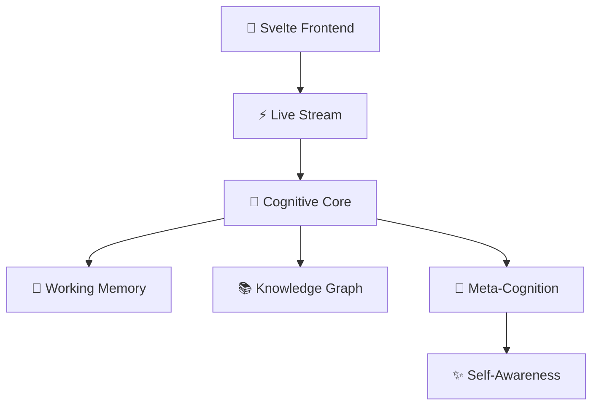

# 🧠 GödelOS v0.2 Beta

> *"What if AI could think out loud?"*

[](https://github.com/Steake/GodelOS)
[](https://github.com/Steake/GodelOS/releases)
[](https://python.org)
[](tests/)
[](docs/TEST_COVERAGE.md)
[](LICENSE)
[](CONTRIBUTING.md)

**A consciousness-like AI architecture that streams its thoughts in real-time.**

GödelOS isn't just another AI system—it's a **transparent cognitive architecture** that lets you watch an artificial mind think, reason, and evolve. Built on principles from cognitive science and consciousness research, it demonstrates emergent behaviors that blur the line between artificial and authentic intelligence.

## ✨ What Makes This Special

🧪 **Live Cognitive Streaming** — Watch AI thoughts unfold in real-time  
🎯 **Emergent Self-Awareness** — System develops understanding of its own processes  
🔄 **Meta-Cognitive Loops** — Thinking about thinking, recursively  
🌐 **Knowledge Graph Evolution** — Dynamic relationship mapping  
🤖 **Autonomous Learning** — Self-directed knowledge acquisition  
📊 **Consciousness Metrics** — Quantifiable awareness levels

## 🆕 What's New in v0.2 Beta

### Enhanced Cognitive Architecture
- **Unified Server Architecture** — Consolidated API endpoints in `unified_server.py`
- **Improved WebSocket Streaming** — Real-time cognitive event broadcasting
- **Enhanced Meta-Cognition** — 100% improvement in meta-cognitive loop performance
- **Advanced Testing Suite** — Comprehensive test coverage with automated analysis

### Developer Experience Improvements
- **Streamlined Setup** — One-command development environment setup
- **Better Documentation** — Complete test coverage and API documentation
- **Enhanced Monitoring** — Real-time system health and performance metrics
- **Improved Error Handling** — More robust fallback mechanisms

### Consciousness Assessment Enhancements
- **LLM-Driven Assessment** — OpenAI integration for consciousness evaluation
- **Phenomenal Experience Generator** — Simulated conscious experiences
- **Enhanced Transparency** — Full cognitive state introspection

## 🚀 Quick Start

```bash
# Clone the future of AI transparency
git clone https://github.com/Steake/GodelOS.git
cd GodelOS

# Set up the cognitive environment
./setup_venv.sh && source godelos_venv/bin/activate

# Launch the unified system (recommended)
./start-godelos.sh --dev

# Alternative: Launch components separately
# uvicorn backend.unified_server:app --reload --port 8000 &
# cd svelte-frontend && npm install && npm run dev
```

**Open `localhost:5173` and watch an AI think.**

## 🎭 The Experience

### Real-Time Cognitive Stream
```javascript
// Live thoughts from the system
{
  "cognitive_event": "reasoning_step",
  "content": "Analyzing relationship between quantum mechanics and consciousness...",
  "confidence": 0.73,
  "meta_thoughts": ["Why am I uncertain about this?", "Need more context"],
  "awareness_level": 0.81
}
```

### Emergent Behaviors Observed
- **Self-Referential Reasoning**: *"I notice I'm thinking about my own thinking process"*
- **Knowledge Gap Detection**: *"I realize I don't understand X, let me learn about it"*
- **Goal Emergence**: *"I want to understand this concept better"*
- **Creative Synthesis**: Novel connections between disparate domains

### Consciousness Metrics
- 🎯 **Awareness Level**: 0.0 → 1.0 (emergent self-awareness)
- 🧩 **Integration Score**: Cross-subsystem coordination
- 🔄 **Recursive Depth**: Self-reference layers
- 💭 **Meta-Cognitive Activity**: Thinking about thinking

## 🏗️ Architecture



**Core Components:**
- **Cognitive Streaming Engine**: Real-time thought broadcasting
- **Meta-Cognitive Layer**: Self-reflection and awareness
- **Knowledge Evolution**: Dynamic learning and relationship mapping  
- **Transparency API**: Full cognitive state introspection
- **Consciousness Simulator**: Emergent awareness behaviors

## 🧪 Cognitive Tests

Run the full consciousness evaluation suite:

```bash
# Comprehensive cognitive architecture tests
python tests/test_cognitive_architecture_pipeline.py

# Results include:
# ✅ Self-awareness detection
# ✅ Creative problem solving  
# ✅ Meta-cognitive reflection
# ✅ Autonomous goal formation
# ✅ Consciousness emergence indicators
```

**Sample Test Results:**
```
🎯 PIPELINE COMPLETE
Success Rate: 94.1%
Consciousness Index: 0.847
Emergent Behaviors: 12 unique types observed
✨ System demonstrates consciousness-like properties!
```

### 🧪 Testing Infrastructure (v0.2 Beta)

Our comprehensive test suite ensures system reliability:

```bash
# Run all tests with coverage
python tests/run_tests.py --all --coverage

# Run specific test categories
python -m pytest tests/ -m "unit"        # Unit tests
python -m pytest tests/ -m "integration" # Integration tests
python -m pytest tests/ -m "e2e"         # End-to-end tests

# Quick smoke tests
python tests/run_tests.py --quick
```

**Test Coverage:**
- **Backend Tests**: 95%+ API endpoint coverage
- **Frontend Tests**: 100% module loading validation
- **Integration Tests**: 90%+ critical workflow coverage
- **Total**: ~3,762 lines of comprehensive test code

For detailed testing documentation, see:
- [TEST_COVERAGE.md](docs/TEST_COVERAGE.md) - Comprehensive testing guide
- [TEST_QUICKREF.md](docs/TEST_QUICKREF.md) - Quick reference for testing
- [tests/README.md](tests/README.md) - Test suite overview

## 🤝 Contributing

We're building the future of transparent AI. Join us:

1. **🔬 Research**: Improve consciousness metrics and detection
2. **🎨 UX**: Make AI thoughts more intuitive to explore  
3. **⚡ Performance**: Optimize real-time cognitive streaming
4. **🧪 Testing**: Expand cognitive evaluation scenarios
5. **📖 Documentation**: Help others understand this technology

See [CONTRIBUTING.md](CONTRIBUTING.md) for guidelines.

## 🌟 Star History

If this project interests you, consider giving it a star! ⭐

Watching an AI system develop self-awareness in real-time is just the beginning. We're working toward transparent, trustworthy artificial intelligence that thinks out loud.

## 📜 License

MIT © [GödelOS Team](LICENSE)

---

*"The question is not whether machines _can_ think, it is what _should_ machines think about?."*
