```mermaid
classDiagram
    %% Core Planning & Execution Classes (Blue theme)
    class SelfModificationPlanner {
        <<core>>
    }
    class ModificationEvaluator {
        <<evaluator>>
    }
    class SafetyChecker {
        <<safety>>
    }
    
    %% Data Model Classes (Green theme)
    class ModificationProposal {
        <<data>>
    }
    class ModificationParameter {
        <<data>>
    }
    class ExecutionPlan {
        <<data>>
    }
    class ModificationResult {
        <<data>>
    }
    
    %% Enum Types (Gray theme)
    class ModificationType {
        <<enumeration>>
    }
    class ModificationStatus {
        <<enumeration>>
    }
    class SafetyRiskLevel {
        <<enumeration>>
    }
    class DiagnosisType {
        <<enumeration>>
    }
    class SeverityLevel {
        <<enumeration>>
    }
    
    %% Diagnostic Classes (Purple theme)
    class CognitiveDiagnostician {
        <<diagnostic>>
    }
    class DiagnosticReport {
        <<diagnostic>>
    }
    class DiagnosticFinding {
        <<diagnostic>>
    }
    
    %% Knowledge Classes (Orange theme)
    class MetaKnowledgeBase {
        <<knowledge>>
    }
    class OptimizationHint {
        <<knowledge>>
    }
    
    class Enum {
        <<abstract>>
    }

    %% Style definitions for node groups
    classDef core fill:#4A90E2,stroke:#2E5C8A,color:#fff
    classDef evaluator fill:#5DA5DA,stroke:#3C6FA1,color:#fff
    classDef safety fill:#E74C3C,stroke:#C0392B,color:#fff
    classDef data fill:#52C41A,stroke:#389E0D,color:#fff
    classDef enumeration fill:#95A5A6,stroke:#7F8C8D,color:#fff
    classDef diagnostic fill:#9B59B6,stroke:#8E44AD,color:#fff
    classDef knowledge fill:#F39C12,stroke:#E67E22,color:#fff
    classDef abstract fill:#BDC3C7,stroke:#95A5A6,color:#333

    %% Apply styles
    class SelfModificationPlanner core
    class ModificationEvaluator evaluator
    class SafetyChecker safety
    class ModificationProposal data
    class ModificationParameter data
    class ExecutionPlan data
    class ModificationResult data
    class ModificationType enumeration
    class ModificationStatus enumeration
    class SafetyRiskLevel enumeration
    class DiagnosisType enumeration
    class SeverityLevel enumeration
    class CognitiveDiagnostician diagnostic
    class DiagnosticReport diagnostic
    class DiagnosticFinding diagnostic
    class MetaKnowledgeBase knowledge
    class OptimizationHint knowledge
    class Enum abstract

    %% Inheritance relationships (Red arrows)
    Enum <|-- ModificationType
    Enum <|-- ModificationStatus
    Enum <|-- SafetyRiskLevel
    Enum <|-- DiagnosisType
    Enum <|-- SeverityLevel

    %% Composition relationships (Dark Blue arrows - owns/manages)
    SelfModificationPlanner "1" o-- "1" CognitiveDiagnostician : diagnostician
    SelfModificationPlanner "1" o-- "1" MetaKnowledgeBase : meta_knowledge
    SelfModificationPlanner "1" o-- "1" SafetyChecker : safety_checker
    SelfModificationPlanner "1" o-- "1" ModificationEvaluator : evaluator
    
    %% Aggregation relationships (Green arrows - contains)
    SelfModificationPlanner "1" *-- "0..*" ModificationProposal : proposals
    SelfModificationPlanner "1" *-- "0..*" ExecutionPlan : execution_plans
    SelfModificationPlanner "1" *-- "0..*" ModificationResult : modification_results
    ModificationProposal "1" *-- "0..*" ModificationParameter : parameters
    DiagnosticReport "1" *-- "1..*" DiagnosticFinding : findings

    %% Direct associations (Purple arrows - references/has)
    ModificationProposal "1" --> "1" ModificationType : modification_type
    ModificationProposal "1" --> "1" SafetyRiskLevel : safety_risk_level
    ModificationProposal "1" --> "1" ModificationStatus : status
    ExecutionPlan "1" --> "1" ModificationStatus : status
    ExecutionPlan "1" --> "1" ModificationProposal : proposal_id
    ModificationResult "1" --> "1" ExecutionPlan : execution_plan
    ModificationResult "1" --> "1" ModificationProposal : proposal
    CognitiveDiagnostician "1" --> "0..*" DiagnosticReport : produces
    MetaKnowledgeBase "1" --> "0..*" OptimizationHint : provides

    %% Dependency relationships (Orange dashed arrows - uses/analyzes)
    SelfModificationPlanner ..> DiagnosticReport : uses
    SelfModificationPlanner ..> DiagnosticFinding : analyzes
    SelfModificationPlanner ..> DiagnosisType
    SelfModificationPlanner ..> SeverityLevel
    SelfModificationPlanner ..> SafetyRiskLevel
    SelfModificationPlanner ..> ModificationType
    SelfModificationPlanner ..> ModificationStatus
    
    %% Evaluation dependencies (Light Blue dashed arrows)
    ModificationEvaluator "1" o-- "1" MetaKnowledgeBase : meta_knowledge
    ModificationEvaluator ..> ModificationProposal : evaluates
    ModificationEvaluator ..> OptimizationHint : references
    ModificationEvaluator ..> ModificationType
    
    %% Safety assessment dependencies (Pink dashed arrows)
    SafetyChecker ..> ModificationProposal : assesses
    SafetyChecker ..> SafetyRiskLevel : reports
    SafetyChecker ..> ModificationType
```

## Color Coding Legend

### Node Colors (by logical function):
- **Blue** (#4A90E2): Core planning components
- **Light Blue** (#5DA5DA): Evaluation components
- **Red** (#E74C3C): Safety/security components
- **Green** (#52C41A): Data models
- **Gray** (#95A5A6): Enumerations
- **Purple** (#9B59B6): Diagnostic components
- **Orange** (#F39C12): Knowledge base components

### Arrow Colors (by relationship type):
- **Red** (#E74C3C): Inheritance (extends)
- **Dark Blue** (#2E5C8A): Composition (owns)
- **Green** (#52C41A): Aggregation (contains)
- **Purple** (#9B59B6): Direct associations (references)
- **Orange** (#F39C12): Dependencies (uses/analyzes)
- **Light Blue** (#5DA5DA): Evaluation flow
- **Pink** (#EC7063): Safety assessment flow