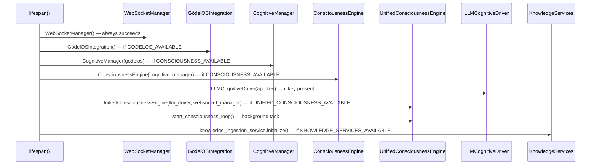

# Backend — unified_server.py

There is a certain kind of engineer — one recognises the type immediately — who, when presented with a system in need of consolidation, resolves the problem by creating a third system and calling it unified. GödelOS has not entirely escaped this tendency. The `backend/` directory contains, at the time of writing, three server implementations: `unified_server.py`, `main.py`, and the now-retired `minimal_server.py`. The unification is in progress; the goal is single, canonical entry point; the current reality is somewhat more complicated.

`unified_server.py` is, however, genuinely intended to be the authoritative implementation, and it is where new development should occur. It is 2,340-plus lines of FastAPI application covering 100-plus endpoints, the startup wiring for every major cognitive component, the WebSocket broadcasting infrastructure, and enough import fallbacks to survive the absence of any single dependency. It is, in this respect, rather like the system it serves: ambitious, architecturally interesting, and not quite finished.

---

## The Server Consolidation Problem

Three files lay claim to the title of "backend server":

| File | Status | Role |
|---|---|---|
| `backend/unified_server.py` | **Active** — canonical implementation | 100+ endpoints, all cognitive components |
| `backend/main.py` | **Compatibility shim** | Re-exports from `unified_server` via `sys.modules` replacement; `create_app()` returns a lightweight FastAPI instance for test injection |
| `backend/minimal_server.py` | **Legacy** — stable subset | Used as a reference for the minimal-viable startup path |

Any test that `patch`es `backend.main.X` is actually patching a global in `unified_server`, because `main.py` replaces itself in `sys.modules` at import time. This is documented in `tests/backend/conftest.py` and is not an accident; it is a deliberate compatibility mechanism.

The correct entry point for production operation is:

```bash
uvicorn backend.unified_server:app --reload --port 8000
# or via the convenience script:
./start-unified-server.sh
```

---

## FastAPI Application Structure

```mermaid
graph TB
    US[unified_server.py]
    LF[FastAPI lifespan]
    MW[Middleware Stack]
    RG[Route Groups]
    WS[WebSocket Endpoints]

    US --> LF
    US --> MW
    US --> RG
    US --> WS

    LF --> INIT[Service Initialisation\nCognitiveManager\nWebSocketManager\nLLM Driver\nKnowledge Pipeline]

    MW --> CORS[CORS Middleware\nall origins in dev]
    MW --> LOG[Request Logging]

    RG --> COG[/api/cognitive/*]
    RG --> CON[/api/v1/consciousness/*]
    RG --> KNO[/api/knowledge/*]
    RG --> TRN[/api/transparency/*]
    RG --> VDB[/api/vector-db/*]
    RG --> SYS[/system/* /health /metrics]

    WS --> WSC[/ws]
    WS --> WSCS[/ws/cognitive-stream]
    WS --> WSUS[/ws/unified-cognitive-stream]
```

---

## Route Groups

The 100-plus endpoints are organised into logical groups, each serving a distinct layer of the cognitive architecture:

| Route Group | Prefix | Purpose |
|---|---|---|
| Cognitive | `/api/cognitive/`, `/cognitive/` | Query processing, cognitive state, reasoning traces |
| Consciousness | `/api/v1/consciousness/` | Consciousness state, assessment, summary |
| Knowledge | `/api/knowledge/` | Import, search, graph operations |
| Transparency | `/api/transparency/` | Reasoning logs, process provenance |
| Vector DB | `/api/vector-db/`, `/api/v1/vector/` | Semantic similarity, embedding operations |
| Metacognitive | `/api/v1/metacognitive/` | Self-awareness metrics, reflection depth |
| System | `/health`, `/metrics`, `/system/status` | Infrastructure health, Prometheus metrics |

A complete and interactive listing is available at `http://localhost:8000/docs` when the server is running — FastAPI's automatic OpenAPI documentation, which is one of the genuine pleasures of the framework.

---

## Startup Wiring

The FastAPI lifespan handler (lines 365–492 of `unified_server.py`) orchestrates the initialisation sequence. The order matters: components that are dependencies of other components must initialise first.



Every component is initialised inside a `try/except` block. The server does not crash if the LLM driver fails to initialise (which happens when no API key is present); it logs a warning and continues with the components that are available. This "degraded operation" philosophy means the system can run in a no-LLM mode that exercises the structural plumbing without requiring an OpenAI subscription.

---

## Dependency Injection

GödelOS uses a module-level global for its service instances rather than FastAPI's built-in `Depends` mechanism:

```python
# Global service instances
godelos_integration = None
cognitive_manager = None
consciousness_engine = None
llm_driver = None
websocket_manager = WebSocketManager()
enhanced_websocket_manager = None
```

These are populated during the lifespan startup and referenced directly in route handlers via closure. This is not idiomatic FastAPI — the `Depends` pattern is generally preferred for testability — but it is pragmatic given the complexity of the initialisation graph and the requirement for graceful degradation.

Route handlers guard against absent services with explicit `None` checks:

```python
@app.post("/api/cognitive/query")
async def process_query(request: QueryRequest):
    if cognitive_manager is None:
        raise HTTPException(503, detail="Cognitive manager not available")
    ...
```

---

## CORS Configuration

The CORS middleware is configured permissively for development:

```python
app.add_middleware(
    CORSMiddleware,
    allow_origins=["*"],
    allow_credentials=True,
    allow_methods=["*"],
    allow_headers=["*"],
)
```

This is appropriate for a local research system. Before any public deployment, `allow_origins` must be restricted to the actual frontend origin. There is currently no authentication layer; the API is open to any client that can reach port 8000.

---

## Backend Module Inventory

The `backend/` directory contains rather more than just the server. The full inventory of substantive modules is as follows:

| Module | Size | Function |
|---|---|---|
| `unified_server.py` | ~2,340 lines | FastAPI application root |
| `knowledge_ingestion.py` | ~94 KB | The largest single file in the backend — comprehensive knowledge import and processing pipeline |
| `llm_cognitive_driver.py` | — | OpenAI API integration; the `process_autonomous_reasoning(prompt)` method is the canonical generic completion interface |
| `cognitive_transparency_integration.py` | — | Transparency logging and process provenance |
| `phenomenal_experience_generator.py` | — | Qualia description generation (see [Phenomenal Experience](../Theory/Phenomenal-Experience)) |
| `attention_manager.py` | — | Attention distribution tracking and modelling |
| `memory_manager.py` | — | Working memory state management |
| `goal_management_system.py` | — | Autonomous goal tracking and prioritisation |
| `contradiction_resolver.py` | — | Detects and resolves logical inconsistencies in the knowledge base |
| `domain_reasoning_engine.py` | — | Domain-specific reasoning strategies |
| `live_reasoning_tracker.py` | — | Real-time reasoning trace capture |
| `response_formatter.py` | — | Standardises LLM output into the response schema |

The `backend/core/` subdirectory contains the consciousness engine components: `unified_consciousness_engine.py`, `consciousness_engine.py`, `cognitive_manager.py`, `metacognitive_monitor.py`, `phenomenal_experience.py`, and the structured logging, error handling, and metrics infrastructure.

---

## The LLM Driver

`backend/llm_cognitive_driver.py` manages all interactions with the OpenAI API. It does not expose a `process()` or `complete()` method. The correct generic text-completion interface is:

```python
await llm_driver.process_autonomous_reasoning(prompt: str) -> str
```

Code that calls the driver generically should use `hasattr` to check for this method before invoking it — a precaution that has saved production from `AttributeError` on at least one occasion:

```python
if llm_driver and hasattr(llm_driver, 'process_autonomous_reasoning'):
    result = await llm_driver.process_autonomous_reasoning(prompt)
```

When no API key is configured, `llm_driver` is `None`, and the system falls back to heuristic consciousness assessment. The fallback produces structurally valid output but lacks the LLM's capacity for generating genuine phenomenal descriptions.

---

## Integration with `backend/core/`

The consciousness engine components in `backend/core/` are imported with availability flags:

```python
try:
    from backend.core.unified_consciousness_engine import UnifiedConsciousnessEngine
    from backend.core.enhanced_websocket_manager import EnhancedWebSocketManager
    UNIFIED_CONSCIOUSNESS_AVAILABLE = True
except ImportError as e:
    logger.warning(f"Unified consciousness engine not available: {e}")
    UnifiedConsciousnessEngine = None
    UNIFIED_CONSCIOUSNESS_AVAILABLE = False
```

The `UnifiedConsciousnessEngine` is the primary orchestrator for the recursive consciousness loop. It holds references to the LLM driver, the WebSocket manager, the knowledge store shim, and the metacognitive monitor, and it coordinates the continuous thought cycle that is the system's central innovation.

The `sys.path.insert` at line 29 of `unified_server.py` ensures that the repository root is on `sys.path` before any `backend.*` imports occur. This is documented in the repository memories as an architectural invariant that must not be removed.

---

## Startup, Environment, and Observability

The server performs three operations at import time, before any request is processed:

1. **`sys.path` insertion** — The repository root is added to `sys.path` so that `backend.*` and `godelOS.*` imports resolve correctly regardless of the working directory.
2. **`dotenv` loading** — Environment variables are loaded from `backend/.env` (or `.env` at the repo root, if no backend-specific file exists). The key variable is `OPENAI_API_KEY`; without it, the LLM driver is unavailable and the system operates in degraded mode.
3. **Structured logging setup** — The `setup_structured_logging()` call in `backend/core/structured_logging.py` configures JSON-formatted log output for production and human-readable output for development. The log level is controlled by the `LOG_LEVEL` environment variable (default: `INFO`).

Prometheus-compatible metrics are exposed at `/metrics` via the `metrics_collector` from `backend/core/enhanced_metrics.py`. The `track_operation` context manager instruments individual route handlers with timing and error-rate metrics. This infrastructure was added as part of the observability improvements and is active on all production-facing routes.

---

## Known Limitations and Active Work

Several aspects of the backend are known to be incomplete:

**Duplicate API prefixes** — The API has routes at both `/api/cognitive/` and `/cognitive/`, both at `/api/v1/consciousness/` and `/consciousness/`, and similarly for other groups. This is the result of the consolidation process: the old routes were retained for backwards compatibility while new routes were added with the canonical prefix. A cleanup pass is planned but has not been prioritised.

**No authentication** — The API has no authentication layer. Every endpoint is accessible to any client that can reach port 8000. This is appropriate for local research; it is not appropriate for any networked deployment.

**knowledge_ingestion.py at 94KB** — The single largest file in the backend is the knowledge ingestion service, at approximately 94 kilobytes. It handles file import, Wikipedia import, URL scraping, text chunking, and vectorisation. Its size is not, in itself, a problem, but it represents a significant concentration of complexity in a single module and should be considered a candidate for decomposition in a future refactoring pass.
