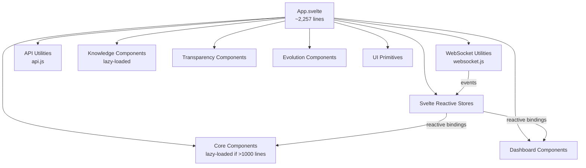

# Frontend — Svelte Dashboard

One might reasonably ask why a consciousness operating system requires a dashboard at all. Consciousness, to the extent that it is a genuine phenomenon, presumably does not need a GUI to validate itself. The answer is, partly, pragmatic — researchers need to see what is happening — and partly, one suspects, something deeper: the system's claims about self-awareness are more compelling when you can watch the numbers move in real time, when you can see the attention distribution shift as the query changes, when the phenomenal experience description updates itself while you read it. A consciousness that cannot be observed is indistinguishable, from the outside, from no consciousness at all.

The frontend is a Svelte application, and it is a substantial one. `svelte-frontend/src/App.svelte` runs to 2,257 lines. The component library contains dozens of individual files, several of which exceed 1,000 lines in their own right. This is not, by itself, a criticism — the dashboard is attempting to visualise a genuinely complex system — but it does mean that the frontend requires the same respectful attention one would give to any non-trivial piece of engineering.

---

## Architecture at a Glance



---

## Technology Stack

| Technology | Version/Notes | Role |
|---|---|---|
| Svelte | 4.x | Reactive UI framework |
| Vite | Build tool | Hot-module replacement in dev |
| JavaScript (ES2020+) | — | Application logic |
| CSS | Custom variables + responsive | Styling |
| WebSocket API | Native browser | Real-time connection to backend |
| Fetch API | Native browser | REST calls to backend |

There is no TypeScript, no external CSS framework, and no state management library beyond Svelte's native reactive stores. The dependency footprint is intentionally minimal.

---

## App.svelte — The Root Component

`App.svelte` is the application's single root. It:

1. Imports reactive stores from `./stores/cognitive.js` and `./stores/enhanced-cognitive.js`
2. Initialises the WebSocket connection on mount via `setupWebSocket()` and `connectToCognitiveStream()`
3. Manages global UI state: active view, sidebar collapse, fullscreen mode, mobile detection
4. Orchestrates a multi-panel layout with a collapsible sidebar navigation
5. Renders the active view by switching between component instances

The modal system is particularly noteworthy: heavy components that would slow initial page load are *not* imported at the top of the file. Instead, their import is deferred until the modal that contains them is opened — a manual implementation of lazy loading that predates the component library's adoption of a formal lazy-loading pattern.

---

## The Lazy Loading Pattern

Several components are large enough that loading them at startup would materially delay time-to-interactive. The solution is to load them on demand, with a comment in `App.svelte` indicating the reason:

```javascript
// import CognitiveStateMonitor from './components/core/CognitiveStateMonitor.svelte';
// LAZY LOADED - 1,442 lines

// import KnowledgeGraph from './components/knowledge/KnowledgeGraph.svelte';
// LAZY LOADED - 3,632 lines

// import TransparencyDashboard from './components/transparency/TransparencyDashboard.svelte';
// LAZY LOADED - 2,011 lines

// import SmartImport from './components/knowledge/SmartImport.svelte';
// LAZY LOADED - 2,468 lines

// import StreamOfConsciousnessMonitor from './components/core/StreamOfConsciousnessMonitor.svelte';
// LAZY LOADED - 1,062 lines

// import AutonomousLearningMonitor from './components/core/AutonomousLearningMonitor.svelte';
// LAZY LOADED - 1,447 lines
```

When a user navigates to one of these views, the component is loaded dynamically via a modal. The modal opens, the component mounts, and the user's first interaction with that panel includes a brief render delay. This is an acceptable trade-off: the alternative would be loading the entire component tree at startup, which on a slow connection would make the initial experience considerably worse.

---

## Component Inventory

### `svelte-frontend/src/components/`

| Directory | Key Components | Notes |
|---|---|---|
| `core/` | `QueryInterface`, `ResponseDisplay`, `HumanInteractionPanel`, `CognitiveStateMonitor` (lazy), `StreamOfConsciousnessMonitor` (lazy), `AutonomousLearningMonitor` (lazy) | Primary user-interaction layer |
| `dashboard/` | `EnhancedCognitiveDashboard` | Loaded immediately; the default view |
| `knowledge/` | `KnowledgeGraph` (lazy, 3,632 lines), `SmartImport` (lazy), `ConceptEvolution` | Knowledge store visualisation |
| `transparency/` | `TransparencyDashboard` (lazy), `ReflectionVisualization`, `ResourceAllocation`, `ProcessInsight`, `ReasoningSessionViewer`, `ProvenanceTracker` | Cognitive transparency tooling |
| `evolution/` | `CapabilityDashboard`, `ArchitectureTimeline` | System evolution tracking |
| `ui/` | `Modal`, `ConnectionStatus` | UI primitives |

The `UnifiedConsciousnessDashboard.svelte` at the top of the `components/` directory is a separate, self-contained dashboard implementation that presents the consciousness metrics in a unified view.

---

## Real-Time Panels

The dashboard's real-time capabilities depend entirely on the WebSocket connection. When the connection is live, five categories of data update continuously:

**Consciousness State** — The awareness level, self-reflection depth, and manifest behaviours from each `consciousness_update` event. These are displayed numerically and as animated indicators. The `systemHealthScore` derived store provides a single composite metric.

**Cognitive Metrics** — Attention distribution, working memory load, processing confidence, and cognitive effort from `cognitive_event` updates. The `CognitiveStateMonitor` (when loaded) renders these as time-series charts.

**Knowledge Graph** — The `KnowledgeGraph` component (3,632 lines, lazily loaded) renders the evolving knowledge graph as an interactive force-directed visualisation. New nodes and edges appear as the knowledge pipeline ingests material.

**Transparency Logs** — The `TransparencyDashboard` and `ReasoningSessionViewer` components surface the real-time reasoning trace, showing the system's chain of inference as it processes queries.

**Phenomenal Experience** — The `StreamOfConsciousnessMonitor` (1,062 lines, lazily loaded) displays the phenomenal description generated by `PhenomenalExperienceGenerator` — the system's first-person account of what it is experiencing.

---

## WebSocket Connection Handling

The WebSocket connection is managed by `svelte-frontend/src/utils/websocket.js`, which exposes two functions used by `App.svelte`:

```javascript
setupWebSocket()         // Initialises the primary WebSocket connection
connectToCognitiveStream() // Subscribes to the cognitive state stream
```

Connection status is tracked in the `cognitiveState` store and surfaced to the user via the `ConnectionStatus` component in the top navigation bar. When the connection drops — which it may, if the backend restarts — the utility implements exponential backoff reconnection. The user sees a "Disconnected" indicator; the dashboard freezes until reconnection succeeds.

Incoming events are dispatched to the appropriate store:
- `consciousness_update` → `cognitiveState`, `enhancedCognitiveState`
- `cognitive_event` → `cognitiveState`
- `knowledge_update` → `knowledgeState`

---

## Reactive Stores

Svelte's reactive store system is the nervous system of the frontend. Two primary store files exist:

**`svelte-frontend/src/stores/cognitive.js`** — Exports `cognitiveState`, `knowledgeState`, `evolutionState`, `uiState`, `apiHelpers`, and the derived `systemHealthScore`.

**`svelte-frontend/src/stores/enhanced-cognitive.js`** — Exports `enhancedCognitiveState`, `autonomousLearningState`, `streamState`, and the `enhancedCognitive` action object, which provides methods for interacting with the enhanced cognitive API.

Components subscribe to these stores with Svelte's `$` prefix syntax. When a WebSocket event updates a store, every component that reads from that store re-renders automatically. This is the mechanism by which the dashboard achieves genuine real-time reactivity without polling.

---

## Responsive Design

The application detects mobile devices on mount:

```javascript
isMobileDevice = /Android|webOS|iPhone|iPad|iPod|BlackBerry|IEMobile|Opera Mini/i.test(navigator.userAgent)
    || window.innerWidth <= 768;
```

On mobile, the sidebar is collapsed by default and the `initializeMobileEnhancements()` utility in `svelte-frontend/src/utils/mobile.js` applies touch-friendly adjustments. The layout uses CSS custom variables for spacing and typography, which allows a single stylesheet to handle both desktop and mobile with media query overrides.

This is not, one should be honest, a mobile-first design. The dashboard was designed for a researcher sitting at a desktop with multiple panels visible simultaneously. Mobile support was added as a layer on top of that design, and while it is functional, it is not the recommended environment for serious work with the system.

---

## Development Workflow

```bash
cd svelte-frontend
npm install
npm run dev     # Starts Vite dev server on http://localhost:5173
npm run build   # Production build to dist/
npm test        # Playwright component tests
```

The dev server proxies API requests to `http://localhost:8000` and establishes a WebSocket connection to the same host. In development, both servers must be running simultaneously; the convenience script `./start-godelos.sh --dev` starts both.

The backend URL is configured in `svelte-frontend/src/config.js`. If the backend is running on a non-default port, this is the file to update.

---

## Navigation and View Structure

`App.svelte` organises the dashboard into named views grouped into sections. The active view is tracked in the `activeView` variable and can be set via URL parameters (`?view=<viewname>`) for direct navigation — useful for linking to specific panels from documentation or issue comments.

The view sections are defined in a `viewSections` object and a `viewConfig` map. Adding a new panel to the dashboard means:

1. Adding a component file in the appropriate `components/` subdirectory
2. Registering a view entry in `viewConfig`
3. Adding a navigation link in `viewSections`
4. Optionally making the component lazy-loaded if its line count exceeds approximately 500 lines

The sidebar is collapsible — users on narrow screens or those who want more space for the main content can collapse it with a single click. On mobile, it is collapsed by default. A `fullscreenMode` toggle removes the sidebar entirely and maximises the active view.

---

## State Management in Depth

The reactive stores are the single most important architectural decision in the frontend. They decouple the WebSocket event-handling logic from the rendering logic entirely: the WebSocket utilities write to stores; the components read from stores; the two halves of the system never need to communicate directly.

The `systemHealthScore` is a *derived* store — it is computed automatically from the values in `cognitiveState` whenever those values change. Components that display the system health indicator never need to subscribe to the raw cognitive state; they subscribe to the derived score and receive updates whenever the underlying data changes.

```javascript
// Reactive binding example (Svelte syntax)
$: healthClass = $systemHealthScore > 0.8 ? 'healthy'
               : $systemHealthScore > 0.5 ? 'degraded'
               : 'critical';
```

This pattern — derive what you need, subscribe to the derivation — keeps component logic minimal and makes the data flow easy to trace. It is one of the genuine architectural strengths of the frontend codebase.

---

## Testing

Frontend tests use Playwright and live in `svelte-frontend/` and at the repository root. They exercise the UI through a real browser against a live backend, making them integration tests rather than unit tests. The full suite is run via `npm test` from the repository root (using the `package.json` at the root) or via `npm test` from `svelte-frontend/` for the component-level tests.

These tests are the slowest in the repository and require both the backend and the frontend development server to be running. They are not suitable for fast feedback during development; they are suitable for validating the full stack before a release. The distinction matters when choosing which tests to run during iterative development.
