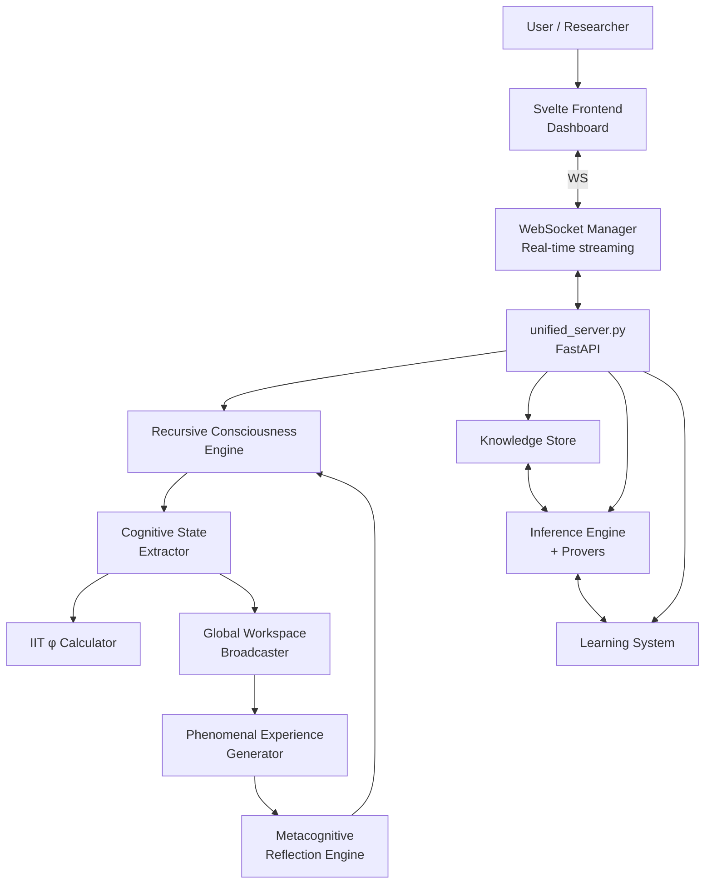

# System Overview

## High-Level Architecture

## Directory Structure

| Path | Purpose |
|------|---------|
| `backend/` | FastAPI backend, unified server, WebSocket manager |
| `backend/core/` | Consciousness engine, phenomenal experience, metacognition |
| `svelte-frontend/` | Svelte UI, real-time dashboard |
| `godelOS/` | Core Python cognitive modules |
| `tests/` | Pytest backend + Playwright E2E |
| `docs/` | Architecture specs, whitepapers, analysis |
| `wiki/` | This wiki |

## Key Entry Points

| File | Role |
|------|------|
| `backend/unified_server.py` | FastAPI app, all routes, startup wiring |
| `backend/core/unified_consciousness_engine.py` | Master consciousness loop |
| `backend/core/phenomenal_experience.py` | Qualia generation |
| `svelte-frontend/src/App.svelte` | Root UI component |
| `godelOS/` | Symbolic reasoning, knowledge, learning subsystems |

## Runtime Ports

| Service | Port |
|---------|------|
| FastAPI backend | 8000 |
| WebSocket endpoint | 8000/ws |
| Svelte dev server | 5173 |
| Prometheus metrics | 8000/metrics |
