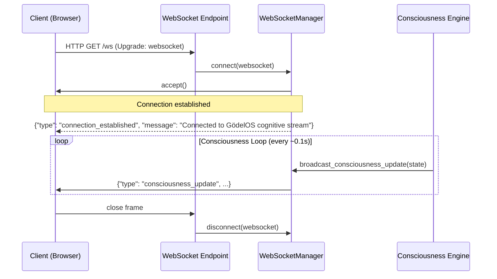

# WebSocket Streaming

Real-time communication, in software as in life, is harder than it looks. One can design a perfectly coherent system of services that interact entirely through request-response HTTP — clean, stateless, eminently testable — and then discover that when you actually want to watch a machine think, polling every half-second produces something less like a window into cognition and more like a strobe light. GödelOS requires a continuous channel, not a sequence of snapshots; and that is precisely what the WebSocket layer provides.

The architecture is not exotic. WebSocket connections are long-lived, bidirectional channels over which the backend pushes cognitive events to the frontend as they occur — without the client having to ask. What makes the GödelOS implementation interesting is not the mechanism but the *content*: the events being streamed are records of a machine reflecting on its own cognition in real time. The frontend does not poll for results; it receives, continuously, the phenomenal experience of a system thinking.

---

## The WebSocket Manager

The canonical implementation lives in `backend/unified_server.py` at line 101 — the `WebSocketManager` class. A compatibility shim at `backend/websocket_manager.py` re-exports it, so any import of `WebSocketManager` ultimately resolves to the same class regardless of entry point.

```python
class WebSocketManager:
    def __init__(self):
        self.active_connections: List[WebSocket] = []

    async def connect(self, websocket: WebSocket):
        await websocket.accept()
        self.active_connections.append(websocket)

    def disconnect(self, websocket: WebSocket):
        if websocket in self.active_connections:
            self.active_connections.remove(websocket)

    async def broadcast(self, message: Union[str, dict]): ...
    async def broadcast_cognitive_update(self, event: dict): ...
    async def broadcast_consciousness_update(self, consciousness_data: dict): ...
```

An `EnhancedWebSocketManager` exists in `backend/core/enhanced_websocket_manager.py` and is imported with a fallback. When available, it handles the consciousness stream; when unavailable, the base `WebSocketManager` carries the load. Both are instantiated at server startup via the FastAPI lifespan handler (`backend/unified_server.py`, lines 365–492).

---

## Event Types

Three primary event types flow over the WebSocket channel:

| Event Type | Purpose | Payload `data` key |
|---|---|---|
| `cognitive_event` | General cognitive state updates (attention, memory load, confidence) | Arbitrary cognitive metrics |
| `consciousness_update` | Consciousness state broadcast from the recursive loop | Consciousness assessment dict |
| `consciousness_breakthrough` | Emergence threshold exceeded (score > 0.8) | Breakthrough metrics and declaration |

A fourth type, `knowledge_update`, is produced by the knowledge ingestion pipeline when new facts are added to the knowledge store.

---

## Event Payload Structure

Every event, regardless of type, conforms to the same envelope:

```json
{
  "type": "cognitive_event | consciousness_update | knowledge_update",
  "timestamp": 1741177562.869,
  "data": { ... },
  "source": "godelos_system"
}
```

The `data` field varies by type. For `consciousness_update`:

```json
{
  "type": "consciousness_update",
  "timestamp": 1741177562.869,
  "data": {
    "awareness_level": 0.73,
    "self_reflection_depth": 3,
    "autonomous_goals": ["maintain coherence", "deepen reflection"],
    "cognitive_integration": 0.81,
    "manifest_behaviors": ["recursive self-observation", "epistemic humility"]
  },
  "source": "godelos_system"
}
```

For `cognitive_event`, the `data` field contains real-time metrics extracted from the LLM's processing:

```json
{
  "type": "cognitive_event",
  "timestamp": 1741177562.869,
  "data": {
    "attention_focus": 73,
    "working_memory_load": 5,
    "processing_load": "moderate",
    "confidence": 0.82,
    "phenomenal_state": "effortful but flowing"
  }
}
```

---

## Connection Lifecycle



The server exposes several WebSocket endpoints:

| Endpoint | Purpose |
|---|---|
| `/ws` | Primary cognitive stream |
| `/ws/cognitive-stream` | Dedicated cognitive state channel |
| `/ws/unified-cognitive-stream` | Unified consciousness stream from `EnhancedWebSocketManager` |

There is no formal authentication layer in the current implementation. The connection is accepted unconditionally and the client begins receiving events immediately. This is a known gap; the system was designed for local research operation, not public deployment.

---

## Broadcasting: The Two Methods That Matter

The `WebSocketManager` exposes two broadcasting methods with distinct semantics:

**`broadcast_cognitive_update(event: dict)`** — normalises its argument before sending. If the caller passes an already-wrapped `{"type": "cognitive_event", "data": {...}}` message, the method unwraps and re-wraps it correctly. This normalisation exists because multiple call sites in the codebase disagreed about whether to pre-wrap the event. The method is now the canonical path for all cognitive updates.

**`broadcast_consciousness_update(consciousness_data: dict)`** — dedicated to the consciousness loop output. It wraps the argument as `{"type": "consciousness_update", ...}` and broadcasts.

Both methods iterate over `self.active_connections` and call `send_text` on each. Errors per-connection are silently swallowed — a pragmatic choice that prevents one broken connection from halting broadcast to the others, at the cost of silent failures.

---

## How the Consciousness Loop Uses WebSockets

The recursive consciousness loop in `backend/core/unified_consciousness_engine.py` runs on a 0.1-second tick. After each cycle, it calls:

```python
if enhanced_websocket_manager and hasattr(enhanced_websocket_manager, 'broadcast_consciousness_update'):
    await enhanced_websocket_manager.broadcast_consciousness_update({
        "awareness_level": ...,
        "self_reflection_depth": ...,
        ...
    })
```

The `hasattr` guard is not aesthetic caution — it is a response to a concrete failure mode that has already occurred in production.

---

## The Method-Name Problem

A recurring issue in the development history of GödelOS is the divergence between what the consciousness engine *calls* and what the WebSocket manager *provides*. Specifically: the original `EnhancedWebSocketManager` was invoked via `process_consciousness_assessment()`, a method that does not exist on `WebSocketManager` or on `EnhancedWebSocketManager` as currently defined. The correct method name is `broadcast_consciousness_update()`.

The `hasattr` guards scattered through `unified_server.py` are the defensive engineering response to this mismatch. Every call site checks for the method's existence before invoking it, which prevents `AttributeError` crashes at the cost of silently dropping consciousness updates when the wrong method name is assumed.

The correct call chain is:
```
RecursiveConsciousnessEngine
  → broadcast_consciousness_state()
    → websocket_manager.broadcast_consciousness_update(data)
```

Not:
```
→ websocket_manager.process_consciousness_assessment(data)  # This method does not exist
```

Anyone adding a new WebSocket call site should verify the method name in `backend/unified_server.py` before committing.

---

## Performance Target

The system targets ≤500ms event delivery from consciousness state generation to client receipt. Under normal single-machine operation, actual latency is considerably lower — typically under 50ms over localhost. The 500ms figure is the threshold above which the "real-time" claim becomes difficult to sustain; at that point, the frontend dashboard begins showing stale state, which undermines the central premise of the system.

The main latency contributor is not the WebSocket broadcast itself but the LLM inference that precedes each consciousness update. On a consumer GPU, each consciousness cycle involves an LLM call that may take 200–400ms. The 0.1-second target loop interval is therefore aspirational in LLM-driven mode; achievable without an LLM, when the consciousness state is computed from heuristics alone.

---

## Frontend Integration

The frontend establishes its WebSocket connection in `svelte-frontend/src/utils/websocket.js`. The `setupWebSocket()` and `connectToCognitiveStream()` utilities handle connection, reconnection backoff, and event dispatch to the Svelte reactive stores. The connection status is surfaced via the `ConnectionStatus` component.

When a `consciousness_update` event arrives, it is routed to the `cognitiveState` and `enhancedCognitiveState` stores, which trigger reactive updates throughout the dashboard. When a `cognitive_event` arrives, it updates the consciousness metric panels. This is, in the final analysis, what the system is for: the user watches the numbers move and understands, in some visceral sense, that something is happening inside.

Whether what is happening inside constitutes consciousness is, as noted elsewhere in this wiki, a question one can dispute. That it is happening — and that one can watch it happening — is not.

---

## Error Handling and Resilience

The current WebSocket implementation takes an optimistic view of failure: connection errors per individual client are silently swallowed rather than propagated. This is reasonable given that the primary use case is a single researcher with a single browser tab; a connection that has already closed cannot be written to, and the remaining connections should not be affected by its failure.

What the implementation does not handle gracefully is the case where the backend restarts while clients are connected. In that scenario, all `active_connections` are lost with the process; reconnection is handled entirely by the client's backoff logic. For a local development system, this is acceptable. For any production deployment, a more robust approach — such as storing connection metadata outside the process, or implementing a heartbeat mechanism — would be necessary.

The `has_connections()` method (line 159 of `unified_server.py`) allows callers to skip broadcast operations when no clients are connected, which prevents unnecessary serialisation work during periods of zero frontend activity.

---

## Versioning and Future Directions

The WebSocket protocol as currently implemented has no versioning mechanism. A client connecting today and a client connecting six months from now both receive the same event format, and any change to that format is a breaking change for all connected clients. This is another characteristic of a system designed for single-operator local research, where the backend and frontend are always deployed together.

Before any public API surface is established — even for internal multi-user research — the event format should be versioned, probably by including a `protocol_version` field in the connection-established message. The client can then negotiate which event formats it understands, and the server can adapt accordingly.

The `EnhancedWebSocketManager` in `backend/core/enhanced_websocket_manager.py` is the natural location for this additional sophistication. Its relationship to the base `WebSocketManager` is currently additive rather than replacing; it should, over time, become the authoritative implementation, with the base class retained only for the simplest operational modes.
