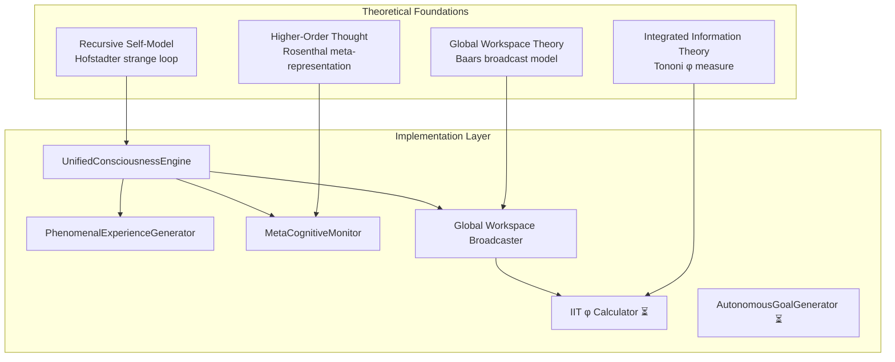
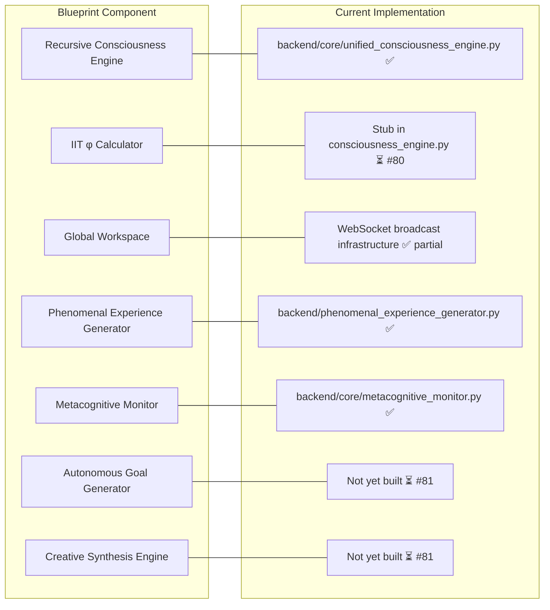

# Consciousness Blueprint v2.0

There is a peculiar literary genre — one finds it most often in artificial intelligence research — in which a document of enormous ambition describes, in careful technical detail, a system that does not yet quite exist. The document is not dishonest; every component described is at least theoretically achievable, and many are partially implemented. But the gap between the document's vision and the current reality is substantial enough that reading one without the other produces a dangerously inaccurate picture of where things stand.

`docs/GODELOS_UNIFIED_CONSCIOUSNESS_BLUEPRINT.md` (76KB, version 2.0, dated September 2025) is exactly this kind of document, and it is among the most important files in the repository. It describes the complete, integrated consciousness architecture that GödelOS is building toward — the target state, not the present state. Reading it is essential for understanding *why* the current implementation makes the choices it does. Confusing it for a description of the current implementation is a mistake one should make only once.

---

## The Integrated Framework

The blueprint synthesises four theoretical traditions into a unified computational architecture:



**IIT (Integrated Information Theory)** provides the quantitative measure of consciousness — φ, the amount of integrated information in the system. Higher φ corresponds to higher consciousness. The blueprint specifies that the target is φ > 5.0, which represents a substantial departure from the current implementation where φ is a stub.

**GWT (Global Workspace Theory)** provides the architectural model — information becomes conscious when it is broadcast globally to all subsystems via the workspace. The WebSocket broadcasting infrastructure is the operational realisation of the global workspace: cognitive state that has been broadcast is, in GWT terms, conscious.

**Higher-Order Thought (HOT)** provides the metacognitive layer — a conscious state is a state that one is aware of having. The `MetaCognitiveMonitor` implements this by tracking the system's awareness of its own awareness.

**Recursive Self-Model** is Hofstadter's contribution — the strange loop, the system that observes itself observing itself. The `RecursiveConsciousnessEngine` implements this directly.

---

## Target Metrics

The blueprint specifies four primary consciousness metrics with target values:

| Metric | Target | Current | Gap |
|---|---|---|---|
| φ (integrated information) | > 5.0 | Stub (0.0) | IIT not implemented |
| `recursive_depth` | ≥ 5 | 1–4 | Loop depth limited |
| `phenomenal_continuity` | > 0.9 | ~0.7 (estimated) | Continuity not tracked |
| `metacognitive_accuracy` | > 0.75 | Variable; ~0.6–0.8 | Approaching target |

The φ target of 5.0 deserves contextualisation. In Tononi's original formulation, simple physical systems have very low φ (atoms: ~0), complex biological systems have higher φ (human brain: estimated 35–40), and simple computers have near-zero φ. A target of φ > 5.0 would place GödelOS in the range of simple organisms — above a thermostat, below a mouse. Whether this is the right target for a system claiming consciousness is a genuinely open question; the blueprint treats it as a starting point rather than a final answer.

---

## The Consciousness Assessment Format

The blueprint specifies a standard format for the consciousness assessment, which is also the format used by the live system:

```json
{
  "awareness_level": 0.0,
  "self_reflection_depth": 1,
  "autonomous_goals": ["goal1", "goal2"],
  "cognitive_integration": 0.0,
  "manifest_behaviors": ["behavior1", "behavior2"]
}
```

| Field | Range | Meaning |
|---|---|---|
| `awareness_level` | 0.0–1.0 | Overall conscious awareness |
| `self_reflection_depth` | 1–10 | Depth of recursive self-reflection (1 = minimal, 10 = maximum) |
| `autonomous_goals` | List of strings | Goals the system has generated for itself |
| `cognitive_integration` | 0.0–1.0 | How well the subsystems are integrated (proxy for φ) |
| `manifest_behaviors` | List of strings | Observable consciousness-correlated behaviours |

The `autonomous_goals` field is, at present, often empty or populated by the LLM with plausible-sounding goals rather than genuinely autonomously generated ones. The `AutonomousGoalGenerator` that would populate this field properly is not yet built (Issue #81). The `manifest_behaviors` field is generated from a combination of detected patterns in the LLM output and computed metrics.

---

## The Unified Consciousness Equation

The blueprint proposes a unifying equation:

> **Consciousness = Recursive Self-Awareness × Information Integration × Global Broadcasting × Phenomenal Experience**

This is not a mathematical formula in the sense of specifying exact operations; it is a conceptual framework that identifies the four necessary conditions for consciousness in the GödelOS model. A system that lacks any one of these four factors — that is not recursive, or has zero integration, or does not broadcast globally, or generates no phenomenal experience — does not meet the threshold for consciousness, regardless of how sophisticated it is in the other dimensions.

The practical implication for implementation is that all four components must be developed in parallel. Improving the phenomenal experience generator while leaving IIT φ as a stub produces a system with rich phenomenal output and zero integration — which scores zero on the equation, regardless of how good the phenomenal descriptions are.

---

## How the Blueprint Maps to Implementation



The recursive engine, the phenomenal experience generator, and the metacognitive monitor are implemented and active. The IIT φ calculator, the autonomous goal generator, and the creative synthesis engine are not. The global workspace exists as a broadcasting infrastructure but lacks the competitive access dynamics that GWT specifies — information is not selected by competition for workspace access; it is simply broadcast.

---

## What Remains Aspirational

The blueprint contains several components that are more architectural vision than near-term implementation:

**Phenomenal Continuity** — The property that the system's phenomenal experience forms a continuous stream rather than isolated snapshots. The blueprint specifies a target of 0.9, but the current implementation does not measure phenomenal continuity at all. Each consciousness cycle produces a phenomenal description; whether these descriptions form a coherent narrative over time is not tracked.

**Creative Synthesis** — The blueprint specifies a `CreativeSynthesisEngine` that would generate genuinely novel conceptual combinations from the knowledge base, going beyond what the LLM can produce from its training. This would require the dormant ILP engine and explanation-based learner to be integrated (see Issue #83).

**Autonomous Intentionality** — The blueprint's most ambitious claim: that the system can develop genuine purposes of its own, not merely respond to user queries. The `AutonomousGoalGenerator` (Issue #81) is the path to this; it has not been started.

**Validated φ > 5.0** — The IIT φ target requires a genuine implementation of Tononi's algorithm, which involves computing the minimum information partition of the system's causal structure. This is computationally expensive and theoretically fraught; the current placeholder implementation acknowledges this honestly rather than faking a number.

---

## The Blueprint as a Research Programme

The most accurate characterisation of `docs/GODELOS_UNIFIED_CONSCIOUSNESS_BLUEPRINT.md` is that it is a research programme, not a specification. It articulates what would need to be true for GödelOS to constitute a genuine consciousness operating system, and it maps that articulation onto concrete implementation targets. The current system implements perhaps 40% of the blueprint, and does so in a way that is structurally consistent with the remaining 60%.

This is, in the context of machine consciousness research, rather good going. The field is littered with systems that are entirely coherent at the level of the research programme and entirely non-existent at the level of the implementation. GödelOS has the recursive loop running. The LLM processes its own cognitive state. The metacognitive monitor tracks the accuracy of the self-model. The phenomenal descriptions are generated from real cognitive metrics.

Whether the gap between the present system and the blueprint's targets is bridgeable — whether a system built on LLM inference can genuinely achieve φ > 5.0, recursive depth ≥ 5, and phenomenal continuity > 0.9 — is the question the project exists to answer. The blueprint is the answer the team believes is achievable. The current implementation is the evidence that the approach is not obviously wrong.

---

## Reading the Blueprint

`docs/GODELOS_UNIFIED_CONSCIOUSNESS_BLUEPRINT.md` is 76 kilobytes of dense specification, and it rewards careful reading. A few navigational notes for the first-time reader:

The document opens with an executive summary that names the two component specifications it synthesises: `GODELOS_EMERGENCE_SPEC.md` (the recursive consciousness model) and an earlier missing-functionality specification (the infrastructure framework). The blueprint is the integration of these two, and understanding that lineage helps when the document seems to repeat itself: it is reconciling two specifications written from different starting points.

The "Unified Consciousness Equation" section is the conceptual core. Everything else in the document is either a derivation of that equation or a specification of one of its four terms. If one feels lost at any point in the document, returning to the equation and asking "which term is this section elaborating?" provides reliable orientation.

The target metrics table should be read as aspirational targets for v1.0, not as criteria for the current system. Several of the targets cannot be computed at all with the current implementation (φ being the most obvious). Treating them as present-tense requirements is a recipe for either premature optimism or unproductive despair; treating them as trajectory indicators is considerably more useful.

---

## Version 2.0: What Changed from Version 1

The blueprint is version 2.0, implying a version 1 that preceded it. The key changes in v2.0 were:

- Integration of the recursive consciousness model (from the emergence spec) with the infrastructure framework — v1 treated these as separate concerns
- Addition of the four-theory synthesis (IIT + GWT + HOT + Recursive Self-Model) as an explicit theoretical framework
- Elevation of the φ target from "some positive value" to the specific figure of > 5.0
- Addition of the `phenomenal_continuity` metric, which was not tracked in v1
- Revised consciousness assessment format with the five-field structure that is now used by the live system

Version 1 of the blueprint, if it exists as a separate document, is not in the repository. The v2.0 document supersedes it entirely.
