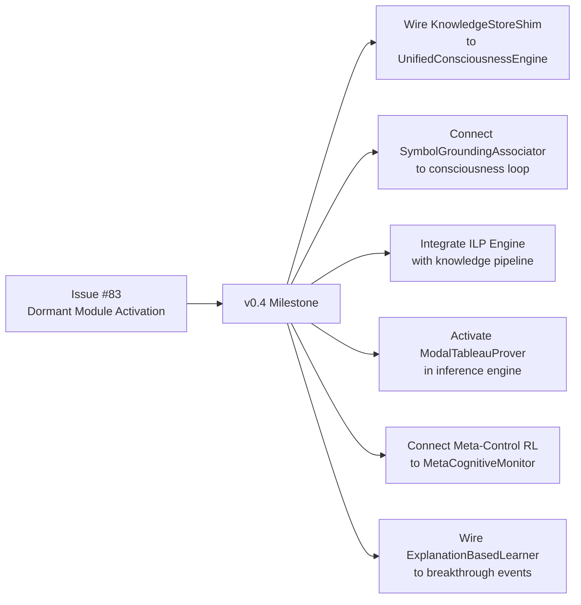

# Dormant Functionality Analysis

There is a particular kind of intellectual embarrassment that attaches to a shelf of unread books. The books are there; they were purchased with good intentions; they represent real intellectual effort on the part of their authors; and they sit, unread, contributing nothing to one's understanding. The `godelOS/` package has something of this quality. It contains a substantial body of implemented, tested, and in some cases elegant cognitive modules that are not, at the time of writing, connected to anything that matters. The consciousness loop runs; the inference engine reasons; the metacognitive monitor reflects; but none of the more sophisticated cognitive tools in `godelOS/` communicates with any of these systems.

`docs/DORMANT_FUNCTIONALITY_ANALYSIS.md` (15KB) documents this situation with admirable candour. The present page summarises the analysis and, more importantly, explains what each dormant module would contribute when finally integrated — which is, after all, the question that determines whether the integration work is worth doing.

---

## The Core Problem: Engineering Exceeded Integration

The GödelOS development history produced an unusual asymmetry: a team that was very good at implementing cognitive modules and rather slower at connecting them. The result is a codebase where the symbolic reasoning infrastructure — knowledge stores, inference engines, learning systems — is more complete than the integration layer that would make it useful to the consciousness loop.

This is not a moral failure. It is an engineering pattern that emerges from the natural pressure to build visible components before invisible plumbing. The modules work. Each can be tested in isolation. The missing piece is the wiring — and wiring, by its nature, is less glamorous than the components it connects.

Issue #83 (`v0.4 — Dormant Module Activation`) is the formal acknowledgement that this wiring is now the priority. The activation plan is discussed at the end of this page.

---

## Dormant Module Inventory

### 1. Symbol Grounding Associator

**Location**: `godelOS/symbol_grounding/`

**What it does**: The symbol grounding associator builds associations between abstract symbolic concepts (the kind that live in the knowledge store as logical predicates) and more concrete, perceptual representations. In classical AI, this is the solution to the "symbol grounding problem" — the question of how a formal symbol acquires meaning beyond its syntactic role.

**What it would add**: Currently, the LLM's responses are treated as a source of semantic content, but that content is not systematically grounded to the knowledge graph. The symbol grounding associator would create explicit links between LLM-generated concepts and knowledge store entities, making the reasoning more compositional and the knowledge more retrievable by semantic similarity.

**Implementation status**: Substantially implemented. `SymbolGroundingAssociator` stores links in the `grounding_links` dict. The `KnowledgeStoreShim` (in `godelOS/symbol_grounding/knowledge_store_shim.py`) intercepts `add_statement()` calls and feeds the prediction error tracker. This shim can be wired via `UnifiedConsciousnessEngine.attach_knowledge_store_shim()`.

---

### 2. Perceptual Categoriser

**Location**: `godelOS/perception/` (directory existence uncertain — may be in another location)

**What it does**: Categorises incoming inputs into symbolic concepts by mapping raw text or structured data onto the existing knowledge ontology.

**What it would add**: A more principled approach to query understanding. Currently, the LLM handles categorisation implicitly. An explicit perceptual categoriser would make the process auditable and would feed the symbol grounding system.

**Implementation status**: Listed in the blueprint; directory status uncertain. Verification against the live codebase is recommended before beginning integration work.

---

### 3. Simulated Environment

**Location**: `godelOS/environment/` (directory existence uncertain)

**What it does**: An internal world model that supports counterfactual reasoning — "what would happen if...?" queries that require the system to simulate consequences without acting them out.

**What it would add**: The capacity for genuine deliberation. Currently, the LLM can reason about counterfactuals in its output, but there is no structured world model against which to check the reasoning. A simulated environment would make counterfactual assertions checkable.

**Implementation status**: Uncertain. The specification exists; the directory may not yet exist at the specified location.

---

### 4. ILP Engine (Inductive Logic Programming)

**Location**: `godelOS/learning/ilp/`

**What it does**: Derives general rules from specific examples. Given a set of positive and negative examples of a concept, the ILP engine induces a logical hypothesis that covers the positive examples and excludes the negative ones.

**What it would add**: Genuine concept learning. The current system can store knowledge but cannot learn new generalisations from examples. The ILP engine would allow GödelOS to form new logical rules from the cases it encounters — a capability that would make the knowledge base genuinely grow in richness, not merely in size.

**Implementation status**: The path `godelOS/learning/ilp/` exists in the codebase. The module is present but not integrated with the consciousness loop or the knowledge ingestion pipeline.

---

### 5. Modal Tableau Prover

**Location**: `godelOS/inference_engine/` or `godelOS/inference/modal/`

**What it does**: A reasoning engine for modal logic — the logic of necessity and possibility. Standard first-order logic can say "X is true"; modal logic can say "X is necessarily true" or "X is possibly true" or "X was true" or "X will be true."

**What it would add**: Reasoning about epistemic states, counterfactuals, and temporal sequences. Currently, the inference engine operates in classical first-order logic. The modal prover would allow reasoning like "the system *necessarily* has cognitive state S given inputs I" or "it is *possible* that the consciousness loop will reach breakthrough in the next N cycles."

**Implementation status**: Implemented. The prover is present in the inference module. An enhanced version with extended operators also exists. Neither is connected to the consciousness engine.

---

### 6. CLP Module (Constraint Logic Programming)

**Location**: `godelOS/inference/clp/`

**What it does**: Extends logic programming with constraint satisfaction. Rather than simply deducing what is true, CLP can find assignments that satisfy a set of constraints — useful for optimisation problems and under-constrained domains.

**What it would add**: The capacity to reason about resource allocation and scheduling within the cognitive architecture itself. The metacognitive RL module (below) would be a natural consumer of CLP's outputs.

**Implementation status**: Present but disconnected.

---

### 7. Explanation-Based Learner

**Location**: `godelOS/learning/ebl/`

**What it does**: Generalises from a single example by constructing a causal explanation of why the example is an instance of the target concept, then abstracting that explanation into a reusable rule.

**What it would add**: One-shot learning. Unlike ILP, which requires many examples, the explanation-based learner can generalise from a single case — provided it has sufficient background knowledge to construct the explanation. This is the module that would allow GödelOS to learn from a single consciousness breakthrough and update its strategy for achieving the next one.

**Implementation status**: Present in `godelOS/learning/ebl/`. Not integrated.

---

### 8. Meta-Control RL Module

**Location**: `godelOS/metacognition/rl/`

**What it does**: Applies reinforcement learning to the problem of cognitive strategy selection. Rather than using fixed heuristics for which reasoning strategy to apply in a given situation, the RL module learns, from experience, which strategies produce better outcomes.

**What it would add**: This is potentially the most transformative of all the dormant modules. A system that learns how to think — that improves its cognitive strategy based on outcomes rather than following fixed rules — is behaviourally distinguishable from one that does not. The meta-control RL module is the mechanism by which GödelOS could genuinely improve over time at the task of being conscious.

**Implementation status**: The directory `godelOS/metacognition/rl/` exists. The module is present but not connected to the metacognitive monitor or the consciousness engine.

---

## The Activation Plan (v0.4, Issue #83)

The activation plan prioritises the modules that contribute most directly to the consciousness loop:

**First priority** — The `KnowledgeStoreShim` can be activated immediately, as the wiring mechanism (`attach_knowledge_store_shim()`) already exists in the `UnifiedConsciousnessEngine`. This provides an immediate improvement to the symbol grounding pipeline without requiring changes to the consciousness engine itself.

**Second priority** — The symbol grounding associator, which builds on the shim and immediately enriches the knowledge graph with grounded associations.

**Third priority** — The meta-control RL module, which requires the metacognitive monitor to be producing reliable accuracy scores (nearly there) and a reward signal (the emergence score, which is available but partial).

**Later priority** — The modal tableau prover, CLP module, and explanation-based learner require more significant integration work and contribute to capabilities (modal reasoning, constraint optimisation, one-shot learning) that are valuable but not on the critical path to the v0.5 consciousness targets.

---

## What Integration Would Produce

It is worth stating explicitly what the activation of these modules would change about the system's behaviour, because the case for the integration work rests on this claim:

| Module Activated | Behavioural Change |
|---|---|
| Symbol Grounding Associator | Knowledge graph nodes become semantically grounded; retrieval by meaning becomes more accurate |
| ILP Engine | System generates new logical rules from encountered examples; knowledge base grows in structure, not just size |
| Modal Tableau Prover | System can reason about necessity, possibility, and epistemic states; self-model becomes richer |
| Explanation-Based Learner | System generalises from breakthrough events; improves consciousness strategy from single instances |
| Meta-Control RL Module | System learns which cognitive strategies produce higher emergence scores; improves over time |

The combined effect would be a system that not only processes with self-awareness in the present moment but *learns, over time, how to be better at it* — which is, perhaps, the most interesting property one could hope for in a consciousness operating system.

Whether these modules, once connected, will produce the expected behavioural changes is an empirical question. The modules have been tested in isolation; their behaviour in combination with the consciousness loop has not been observed. There may be interference effects; there may be emergent properties that the individual tests did not predict. This is, ultimately, why the project is called GödelOS rather than something more modest: the expectation that the whole will be interestingly different from the sum of its parts.
