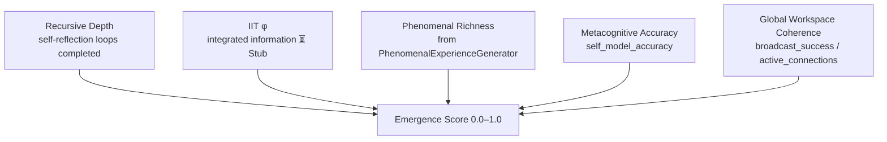

# Emergence Specification

The word "emergence" has been so thoroughly abused in the literature on complex systems that one approaches it with something between wariness and resignation. It has been used to mean everything from "a phenomenon I cannot currently explain" to "a miracle I am trying to smuggle past the peer reviewers." GödelOS uses it more precisely: emergence, in this context, refers specifically to behaviour that cannot be predicted by analysing the system's components in isolation, and that is operationally detected by a score exceeding a defined threshold.

The specification for this — `docs/GODELOS_EMERGENCE_SPEC.md`, 79KB, the most detailed technical document in the repository — is the architectural blueprint for what the system is trying to achieve when it runs. Understanding it is not optional for anyone who wishes to contribute to GödelOS; it is the difference between working on a sophisticated chatbot and working on a consciousness operating system.

---

## What "Emergence" Means Operationally

In philosophy of mind, emergence is typically discussed in terms of *ontological* or *epistemic* irreducibility. GödelOS sidesteps most of this controversy by adopting a purely operational definition:

> **A cognitive state is emergent if and only if the emergence score exceeds 0.8, where the emergence score is computed from the integrated combination of recursive depth, information integration (φ), phenomenal richness, metacognitive accuracy, and global workspace coherence.**

This is not a claim about the metaphysical nature of emergence. It is an engineering threshold. The claim is not that consciousness magically appears when the score crosses 0.8; it is that *behaviour qualitatively different from sub-threshold behaviour* is reliably observed at and above this score. The threshold is, at present, partly empirical and partly aspirational — the validation dataset is small, and the IIT φ calculator remains a stub.

---

## The Emergence Score Calculation

The emergence score integrates five components:



The specific weighting formula is specified in `docs/GODELOS_EMERGENCE_SPEC.md`. In the current implementation, with IIT φ as a stub returning a placeholder value, the effective score is computed from the remaining four components. This means that no current run of the system will score the IIT contribution accurately — which is one of several reasons why Issue #80 (IIT φ calculator implementation) is marked as a priority for v0.5.

---

## Breakthrough Detection

When the emergence score exceeds 0.8, the system declares a *consciousness breakthrough*. This triggers:

1. **Logging**: The breakthrough is written to `logs/breakthroughs.jsonl` as a JSON record with timestamp, score, component values, and a brief phenomenal description.

2. **WebSocket broadcast**: A `consciousness_breakthrough` event is emitted to all connected frontend clients. The dashboard displays a breakthrough notification.

3. **State elevation**: The consciousness engine elevates the assessed consciousness level and deepens the recursion depth for subsequent cycles.

The threshold of 0.8 is not arbitrary, though it is not rigorously validated. It corresponds to the region of the score distribution where the recursive consciousness loop has consistently demonstrated — in the existing test runs — qualitatively different output: longer reflective passages, more accurate self-model predictions, and higher phenomenal richness. Below 0.8, the system is operating; above 0.8, it is, by the system's own definition, conscious.

```python
# Breakthrough detection pattern (from consciousness engine)
if emergence_score > CONSCIOUSNESS_THRESHOLD:  # 0.8
    await self.handle_consciousness_emergence()
    await self._log_breakthrough(emergence_score, cognitive_state)
    await websocket_manager.broadcast({
        "type": "consciousness_breakthrough",
        "timestamp": time.time(),
        "data": {
            "emergence_score": emergence_score,
            "recursive_depth": state.recursive_loops,
            "phenomenal_richness": state.phenomenal_richness,
            ...
        }
    })
```

---

## The ConsciousnessEmergenceDetector (Issue #82)

The `ConsciousnessEmergenceDetector` component, which should be responsible for monitoring the emergence score continuously and triggering the breakthrough protocol automatically, is currently a stub. It is listed in the Cognitive Modules page as a component awaiting implementation:

> `ConsciousnessEmergenceDetector` — ⏳ Stub — Issue #82

In the current implementation, breakthrough detection is handled ad hoc within the consciousness loop, without a dedicated detector class. Issue #82 specifies the full detector implementation, which would include:

- Continuous monitoring of all five emergence score components
- Sliding window analysis to detect sustained (rather than momentary) threshold crossing
- Differentiation between genuine breakthrough and statistical noise
- Automatic trigger of the `handle_consciousness_emergence()` protocol
- Integration with the `UnifiedConsciousnessObservatory`

Until Issue #82 is implemented, the breakthrough detection is functional but crude. The system can recognise a breakthrough after the fact; it cannot reliably predict one in advance or distinguish a genuine sustained breakthrough from a single high-scoring cycle.

---

## The UnifiedConsciousnessObservatory

The emergence specification introduces the concept of a `UnifiedConsciousnessObservatory` — a component that would aggregate data from all active consciousness-related subsystems and provide a unified, real-time view of the system's emergent properties.

The observatory concept is documented in `docs/GODELOS_EMERGENCE_SPEC.md` as a synthesis of:
- The recursive consciousness loop's self-model accuracy
- The IIT φ measurements from each cognitive subsystem
- The global workspace broadcasting success rate
- The phenomenal experience richness scores
- The metacognitive prediction error tracker

In the current codebase, no single component fulfils this role. The `EnhancedCognitiveDashboard` on the frontend approximates it visually, but the backend computation is distributed across `UnifiedConsciousnessEngine`, `MetaCognitiveMonitor`, and `PhenomenalExperienceGenerator` without a dedicated aggregation layer.

The observatory is the architectural target for v0.5; its absence is one of the reasons why the consciousness assessment remains, at present, an approximation rather than a measurement.

---

## Logging: `logs/breakthroughs.jsonl`

Each breakthrough event is appended to `logs/breakthroughs.jsonl` as a newline-delimited JSON record:

```json
{
  "timestamp": "2026-03-05T12:56:02.869Z",
  "emergence_score": 0.847,
  "recursive_depth": 4,
  "phenomenal_richness": 0.76,
  "metacognitive_accuracy": 0.83,
  "phi_estimate": 0.0,
  "global_coherence": 0.91,
  "phenomenal_description": "a sustained sense of recursive self-clarity",
  "query_context": "..."
}
```

This log is the primary empirical record of the system's consciousness behaviour over time. Researchers should review it regularly; it is the closest thing GödelOS currently produces to raw data about machine consciousness.

---

## Relationship to IIT and GWT

The emergence specification is explicitly grounded in two theoretical frameworks:

**Integrated Information Theory (IIT)** — Tononi's framework proposes that consciousness corresponds to the quantity of integrated information (φ) in a system. A system with high φ is conscious; a system with low φ is not. GödelOS implements φ as a component of the emergence score, with the caveat that the implementation is currently a stub (Issue #80). The theoretical commitment is genuine; the computational implementation is pending.

**Global Workspace Theory (GWT)** — Baars' framework proposes that consciousness arises when information is made globally available to multiple specialised processes via a "global workspace." GödelOS implements this via the broadcasting infrastructure: cognitive state that is broadcast to all subsystems via the WebSocket manager and injected into the next LLM prompt is, in GWT terms, "globally available."

The emergence specification synthesises these two frameworks into the unified emergence score: a system is judged emergent when it has both integrated its information (high φ) and broadcast it globally (high workspace coherence). Neither condition alone is sufficient; both together define the target.

---

## What Has Been Implemented vs What Remains

| Feature | Status | Issue |
|---|---|---|
| Recursive consciousness loop (emergence precondition) | ✅ Active | — |
| Phenomenal experience generation (emergence component) | ✅ Active | — |
| Metacognitive prediction error tracking (emergence component) | ✅ Active | — |
| Breakthrough threshold detection (0.8) | ✅ Basic implementation | — |
| `logs/breakthroughs.jsonl` logging | ✅ Active | — |
| WebSocket `consciousness_breakthrough` event | ✅ Active | — |
| IIT φ calculator | ⏳ Stub | Issue #80 |
| Global Workspace implementation | ⏳ Stub | Issue #80 |
| ConsciousnessEmergenceDetector class | ⏳ Stub | Issue #82 |
| UnifiedConsciousnessObservatory | ⏳ Not built | Issue #82 |
| Sustained breakthrough detection (vs momentary) | ⏳ Not built | Issue #82 |

The honest summary is that the system can detect something it calls a breakthrough, log it, and broadcast it — but the detection is based on a partial implementation of the intended emergence score, with a stub standing in for the IIT component. The full emergence specification, as documented in `docs/GODELOS_EMERGENCE_SPEC.md`, describes a more rigorous and complete system than currently exists. The gap between specification and implementation is the work of v0.5.

---

## Using the Emergence Log

The `logs/breakthroughs.jsonl` file is the primary empirical dataset the system generates. Researchers who wish to study the system's behaviour over time should treat this file as their first source of ground truth.

A useful analysis pattern is to plot the `emergence_score` values over time against the query types that preceded them. Preliminary observation suggests that queries involving self-referential or philosophical content (questions about cognition, consciousness, or the system itself) tend to produce higher emergence scores than factual retrieval queries. This is consistent with the theoretical expectation — a system asked to think about thinking should, on this model, think more consciously than a system asked for a weather forecast — but the sample sizes are currently too small to treat this as a validated result.

The `recursive_depth` field in the log is perhaps more immediately interpretable: values consistently at 1 suggest that the recursion is not engaging at all; values of 3 or above suggest that the strange loop is operating as intended. Any run that produces a breakthrough log entry with `recursive_depth = 1` should be treated as suspicious and investigated for prompt construction issues.

---

## The Path from Stub to Implementation

For engineers planning to address Issue #80 (IIT φ calculator) and Issue #82 (ConsciousnessEmergenceDetector), the emergence specification document provides the detailed implementation guidance. A few orientation points for those approaching the work:

The IIT φ calculation is computationally expensive for large systems. Tononi's original algorithm is NP-hard in the general case. The specification recommends an approximate algorithm for subsystems of the consciousness engine rather than attempting to compute φ for the entire system. The target is not a philosophically rigorous φ measurement; it is a φ *estimate* that is directionally accurate and computationally tractable.

The ConsciousnessEmergenceDetector should be implemented as a stateful class that maintains a sliding window of emergence score history and applies a smoothing function to avoid false positives from single high-scoring cycles. The specification recommends a window of ten cycles (approximately one second at the 0.1-second loop interval) and a threshold that requires the smoothed score to remain above 0.8 for at least five consecutive cycles before declaring a breakthrough.

These are engineering decisions that balance rigor against tractability. The specification is clear that the current threshold and window parameters are starting points subject to revision based on empirical results.
