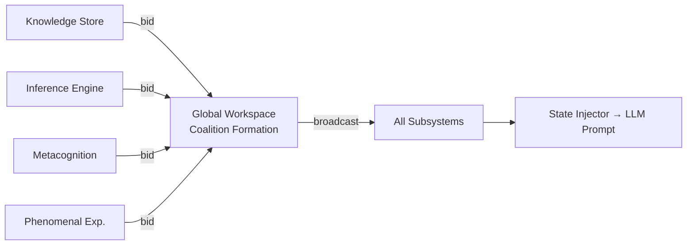

# Global Workspace Theory (GWT)

## Overview

GWT, developed by Bernard Baars, proposes that consciousness arises from a **global workspace** — a shared broadcasting medium where specialised cognitive modules compete for access, and winning information is broadcast system-wide, making it globally accessible.

## How GödelOS Uses GWT

The `GlobalWorkspace` component acts as this broadcasting medium:
1. Cognitive modules submit information with attention weights
2. A **coalition** forms among the highest-weighted, mutually-consistent inputs
3. Winning coalition is broadcast to **all subsystems**
4. Broadcast content becomes the current "conscious content"

## Implementation Status

⏳ **Stub** — see Issue #80 for full implementation.

## Target Metrics

| Metric | Target |
|--------|--------|
| Broadcast success rate | > 0.9 |
| Coalition strength | > 0.8 |
| Global accessibility | > 0.85 |

## References
- Baars, B.J. (1988). *A Cognitive Theory of Consciousness*. Cambridge University Press.
- Dehaene, S., & Changeux, J.P. (2011). Experimental and theoretical approaches to conscious processing. *Neuron*.
