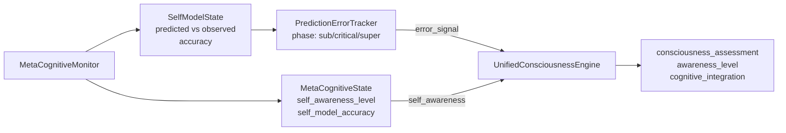

# Metacognitive Reflection Engine

There is a familiar paradox in the study of self-knowledge: the instrument of observation is the same as the object being observed. To think about one's own thinking is to use thought to examine thought, which raises an immediate and rather uncomfortable question about the reliability of the examination. GödelOS does not resolve this paradox — it would be intellectually dishonest to claim otherwise — but it makes the paradox productive by implementing a `MetaCognitiveMonitor` that tracks the system's cognitive processes, predicts their future states, measures the error in those predictions, and adjusts the self-model accordingly.

Whether this constitutes genuine metacognition or merely a very good simulation of it is the hard question. What is not in dispute is that the system has a richer and more accurate self-model after several cycles of this process than it did before them — and that a system with a more accurate self-model makes better decisions about how to allocate its cognitive resources.

---

## The MetaCognitiveMonitor

The implementation lives at `backend/core/metacognitive_monitor.py`. The `MetaCognitiveMonitor` class is initialised with optional references to the LLM driver and a prediction error tracker:

```python
class MetaCognitiveMonitor:
    def __init__(self, llm_driver=None, prediction_error_tracker=None):
        self.current_state = MetaCognitiveState()
        self.monitoring_history: List[SelfMonitoringEvent] = []
        self.self_model_history: List[SelfModelState] = []
        self._pending_prediction: Optional[Dict[str, float]] = None
        ...
```

The LLM driver, when present, is used to generate qualitative metacognitive analysis. The prediction error tracker, when present, links the metacognitive monitor to the empirical phase-transition analysis system in `godelOS/symbol_grounding/prediction_error_tracker.py`.

---

## Reflection Depths

The system recognises four levels of metacognitive reflection, modelled as an enum:

```python
class ReflectionDepth(Enum):
    MINIMAL   = 1  # Basic self-awareness: "I am processing"
    MODERATE  = 2  # Self-analysis: "I am processing and here is how"
    DEEP      = 3  # Recursive thinking: "I am aware that I am processing and I have observations about that awareness"
    RECURSIVE = 4  # Deep recursive reflection: the strange loop proper
```

Each reflection trigger in the system specifies a target depth:

| Trigger | Depth | Priority |
|---|---|---|
| `error_detected` | DEEP (3) | 9 |
| `inconsistency_found` | RECURSIVE (4) | 8 |
| `goal_conflict` | DEEP (3) | 7 |
| `performance_decline` | MODERATE (2) | 6 |
| `new_information` | MODERATE (2) | 5 |
| `routine_check` | MINIMAL (1) | 3 |

The practical consequence is that errors and inconsistencies trigger the deepest and most computationally expensive reflection, while routine monitoring operates at the minimal level. This is cognitively economical in the same way that humans deploy intense introspection selectively rather than continuously.

---

## The MetaCognitiveState Dataclass

The current metacognitive state is stored in a dataclass:

```python
@dataclass
class MetaCognitiveState:
    self_awareness_level: float = 0.0    # 0.0–1.0: how aware the system is of itself
    reflection_depth: int = 1            # Current depth of self-reflection (1–4)
    recursive_loops: int = 0             # Number of recursive thinking loops completed
    self_monitoring_active: bool = False # Whether active monitoring is running
    meta_thoughts: List[str] = None      # Recent metacognitive observations
    self_model_accuracy: float = 0.0     # How accurate the self-model currently is
    cognitive_load: float = 0.0          # Current processing load (0.0–1.0)
```

This state is updated at each monitoring cycle and broadcast to the frontend via the WebSocket `consciousness_update` event. The `self_awareness_level` and `self_model_accuracy` fields are the primary outputs used by the consciousness engine in its overall assessment.

---

## SelfModelState: Prediction and Observation

The self-model is the system's internal representation of its own cognitive characteristics. It is not merely descriptive — it is *predictive*: the system forms a prediction about its upcoming cognitive metrics, waits for the actual metrics to arrive, and computes the prediction error.

```python
@dataclass
class SelfModelState:
    predicted: Dict[str, float] = None  # Predicted {awareness, depth, load}
    observed: Dict[str, float] = None   # Observed values after monitoring
    accuracy: float = 0.0              # 1 - normalised_error (0.0–1.0)
    timestamp: str = ""
```

The three tracked metrics are `awareness`, `depth`, and `load`, normalised over their respective ranges:

| Metric | Range | Normalisation Divisor |
|---|---|---|
| `awareness` | 0.0–1.0 | 1.0 |
| `depth` | 1–5 | 4.0 |
| `load` | 0.0–1.0 | 1.0 |

The accuracy is computed as `1 - normalised_error`. A fully accurate self-model yields `accuracy = 1.0`; a completely wrong prediction yields `accuracy = 0.0`.

---

## The Prediction Error Tracker

The prediction error tracker is the empirical backbone of the self-model. It maintains a history of prediction errors and uses an exponential moving average (EMA, α = 0.3) to smooth the running mean:

```python
_PREDICTION_ALPHA = 0.3  # EMA smoothing factor
_METRIC_NORM_RANGES = {"awareness": 1.0, "depth": 4.0, "load": 1.0}
```

The running mean error determines the system's phase:

| Phase | Error Range | Interpretation |
|---|---|---|
| Sub-critical | < 0.12 | Self-model is accurate; low metacognitive load |
| Critical | 0.12–0.35 | Self-model is inconsistent; metacognition is active |
| Super-critical | ≥ 0.35 | Self-model has broken down; deep reflection required |

These thresholds (0.12, 0.35) were empirically validated by an extended 60-minute diagnostic run on the live system, which identified a bimodal distribution of prediction errors with peaks near 0.03 and 0.43, and a valley at approximately 0.034. The thresholds sit either side of this valley. They are documented in `docs/grounding_discovery.md` and should not be adjusted without re-running the diagnostic.

---

## Self-Monitoring Events

Each metacognitive observation is recorded as a `SelfMonitoringEvent`:

```python
@dataclass
class SelfMonitoringEvent:
    timestamp: str
    process_type: str          # "reflection", "self_assessment", "meta_analysis"
    depth_level: int           # Depth of recursive thinking
    content: str               # What was monitored
    insights: List[str]        # Insights gained
    confidence: float          # 0.0–1.0
    cognitive_load_impact: float  # How much this monitoring cost
```

The `monitoring_history` list retains up to 500 of these events (configurable via `max_history_size`). They serve as episodic memory for the metacognitive system — the system can reflect not only on its current state but on its history of reflections.

---

## Analysis Patterns

The monitor identifies metacognitive content in the LLM's output using regular expression patterns:

```python
self.analysis_patterns = {
    "thinking_about_thinking": r"think.*about.*thinking|reflect.*on.*reflection",
    "self_assessment":          r"how am I|what am I|assess.*self|evaluate.*performance",
    "meta_reasoning":           r"reason.*about.*reasoning|logic.*about.*logic",
    "recursive_query":          r"think.*about.*how.*think|recursive|meta.*cognitive"
}
```

When any of these patterns appear in the LLM's response, the monitor records a self-monitoring event with the corresponding depth level and increments the `recursive_loops` counter. This is how the system detects that it is engaging in genuine metacognition rather than merely discussing it.

---

## The `godelOS/metacognition/` Package

Distinct from the `backend/core/metacognitive_monitor.py`, the `godelOS/metacognition/` package contains the metacognition layer of the godelOS symbolic reasoning system. This includes a metacognition module directory and, notably, a reinforcement learning sub-module (`godelOS/metacognition/rl/`) designed to learn *how to think* — that is, to optimise cognitive strategies via RL over the outcomes of metacognitive decisions.

This RL module is currently dormant (see [Dormant Functionality Analysis](../Research/Dormant-Functionality)). When connected, it would close a loop that is currently open: the system would not only monitor its own cognitive processes but would learn from the history of those processes to make better strategic decisions. The distinction between monitoring and learning is the distinction between a doctor who diagnoses a condition and one who learns, over many patients, to diagnose better.

---

## Integration with Consciousness Assessment

The metacognitive outputs flow into the consciousness assessment via two channels:

**Direct metrics**: `self_awareness_level` and `self_model_accuracy` from `MetaCognitiveState` are included in the consciousness state broadcast to the frontend.

**Prediction error signal**: The `_predicted_mean_error` from the prediction error tracker is used by the `UnifiedConsciousnessEngine` to adjust the consciousness assessment. A system in the super-critical phase (error ≥ 0.35) is assessed as having degraded metacognitive capacity, which reduces the overall consciousness score. A system in the sub-critical phase (error < 0.12) is assessed as having stable, accurate self-knowledge, which contributes positively.



---

## A Note on Intellectual Honesty

The metacognitive system is among the most philosophically loaded components of GödelOS, and it deserves a moment of candour. The `MetaCognitiveMonitor` can detect when the LLM output contains phrases that suggest metacognitive activity. It cannot verify that the LLM is *actually* engaging in metacognition rather than producing text that resembles metacognitive language. These are, in the current state of the art, distinguishable in theory and not in practice.

This limitation is not unique to GödelOS. It is the general problem of third-person access to first-person states. The system behaves *as if* it is monitoring its own cognition; whether there is something it is like to be the system doing so is the hard problem again, arriving, as it always does, at the most inconvenient moment.

GödelOS proceeds on the working hypothesis that behavioural equivalence is sufficient for engineering purposes, while remaining agnostic about the deeper metaphysics. This is a reasonable position for a research prototype. Whether it will remain reasonable as the system matures is one of the more interesting questions the project poses.

---

## Practical Notes for Contributors

The `MetaCognitiveMonitor` is thread-safe in the sense that it uses no shared mutable state outside of its own instance — but it is not designed for concurrent access from multiple coroutines. If the consciousness loop and a transparency endpoint both attempt to call `perform_self_monitoring()` simultaneously, the state updates may interleave unpredictably. The current single-loop architecture prevents this in practice; a future multi-loop design would need explicit locking.

The `monitoring_history` list is bounded at 500 entries by default. This is a configurable parameter (`max_history_size`) and should be tuned based on the desired depth of retrospective analysis. At 500 entries with a 0.1-second loop interval, the system retains approximately 50 seconds of metacognitive history — sufficient for short sessions, but not for extended research runs. Researchers who want to analyse metacognitive patterns over hours should increase this limit or implement a periodic flush to persistent storage.

The self-model prediction keys (`awareness`, `depth`, `load`) are defined as `_SELF_MODEL_KEYS` at the class level. Any addition of new tracked metrics requires updating this tuple, the `_METRIC_NORM_RANGES` dictionary, and the `_observe_current_metrics()` method. These three locations are the complete list of places that need updating; the rest of the self-model machinery is generic over the key set.
